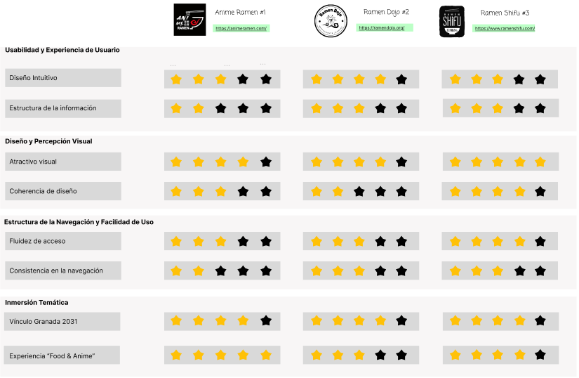
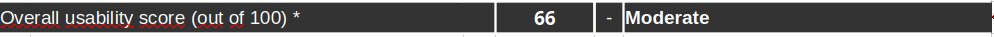

# DIU26
Prácticas Diseño Interfaces de Usuario (Tema: .... ) 

* [Guiones de prácticas](GuionesPracticas/)
* [Guía para crea tu Case Study](Guia_CaseStudy.md)
* Sala de la Fama [DIU Hall of fame](https://github.com/mgea/DIU/tree/master/hall_of_fame) donde se pueden encontrar Case Study destacados de otros años.

Actualizado: 14/01/2026

Grupo: DIU1.HustleHard  Curso: 2025/26 

Nombre del Proyecto: 

Nombre Proyecto: Ghibli Experience

Descripción: 

Nuestra propuesta consiste en la creación de un restaurante inspirado en el universo creativo de Hayao Miyazaki y las peliculas de Studio Ghinli. El concepto del restaurante gira entorno a cuatro peliculas diferentes, ofrenciendo a los clientes la posibilidad de elegir la experiencia que desean vivir según su personalidad y estado de ánimo en el que se encuentren. No solo tratará de un simple restaurante convencional basado en decoración superficial, sino  en un espacio con coherencia narrativa y estética, donde cada ambiente represente un "bioma" inspirado en una película concreta.
Cada uno de estos espacios contará con una ambientación propia, una zona diferenciada y un menú especial inspirado en la obra correspondiente. Además, los clientes podrán elegir cualquier plato de la carta general, pero también tendrán la opción de disfrutar de platos exclusivos vinculados a la experiencia seleccionada. Todas estas experiencias diferentes reflejarán también la temática y sentimientos de la película.

Logotipo: 

>>> Si diseña un logotipo para su producto en la práctica 3 pongalo aqui, a un tamaño adecuado. Si diseña un slogan añadalo aquí

Miembros y nombre del equipo:
 * :bust_in_silhouette:  [Javier Romero Gálvez](https://github.com/JavierRG6) :octocat:     
 * :bust_in_silhouette:  [Pablo Antonio Caballero Carmona](https://github.com/pabloacaballer) :octocat:
----- 

 

# Proceso de Diseño 

 

## Paso 1. UX User & Desk Research & Analisis 

### 1.a User Reseach Plan
 
-----

Nuestro proyecto se centra en el análisis de la hostelería temática, concretamente en la unión de la gastronomía japonesa con la cultura del anime en el contexto de Granada 2031. Investigaremos cómo los usuarios interactúan con plataformas que ofrecen una inmersión cultural, identificando motivaciones y barreras de los "otakus" y turistas. El objetivo es evaluar si la interfaz de **Anime Ramen** comunica su valor diferencial frente a competidores como **Ramen Dojo**. Buscamos optimizar el flujo de reserva y consulta de carta para convertir una necesidad básica (comer) en una experiencia de usuario memorable, eficiente y alineada con la innovación hostelera.

### Objetivos generales + KPI's o Métricas

| Objetivos | KPI's / Métricas |
| :--- | :--- |
| **Aumentar la conversión de reservas** en el restaurante temático | - Tasa de finalización del formulario de reserva   - Número de reservas confirmadas vía web mensual |
| **Consolidar el sentimiento de comunidad** "Anime & Food" | - Número de registros en el club de fidelidad/newsletter   - Interacciones en la sección de eventos culturales |
| **Evaluar la eficacia del diseño visual** temático | - Tiempo promedio de permanencia en la galería de platos   - Tasa de rebote en la página de inicio |
| **Medir la satisfacción de la experiencia** de usuario digital | - Puntuación media en encuestas de satisfacción (CSAT)   - Ratio de clics (CTR) en el menú digital interactivo |

---

### Información cualitativa y cuantitativa
A continuación definiremos los métodos para obtenerlos:

#### Información cualitativa:
* **Análisis Heurístico:** Realizaremos una inspección de la interfaz basada en los principios de usabilidad para detectar fallos de diseño y navegación.
* **Entrevistas en profundidad:** Hablaremos con usuarios habituales de restaurantes temáticos para entender qué valoran más (ambientación, rapidez, fidelidad al anime).
* **Pruebas de usabilidad:** Evaluaremos la facilidad de uso de las funcionalidades clave (reserva y menú) obteniendo feedback directo.

#### Información cuantitativa:
* **Encuestas de satisfacción:** Realizaremos cuestionarios para medir el agrado de los usuarios durante la navegación y su interés por la temática anime.
* **Análisis de métricas:** Mediremos parámetros como el tiempo promedio de permanencia o la tasa de abandono en el proceso de reserva.
* **Cuestionarios SUS:** Aplicaremos la escala *System Usability Scale* para obtener un valor numérico sobre la facilidad de uso del sistema.

### 1.b Competitive Analysis
 
-----

Hemos decidido centrarnos en la web de Anime Ramen. Consideramos que, aunque tiene una propuesta visual potente, presenta oportunidades de mejora en la fluidez de reserva y la jerarquía de información frente a sus competidores. Analizaremos esta plataforma frente a Ramen Dojo, que destaca por su integración de comunidad y eventos, y Akiba (o similar), un referente en el sector de restauración tematizada con un flujo de usuario muy pulido.

Nuestro objetivo es detectar áreas de mejora en la usabilidad de Anime Ramen tomando como referencia los puntos fuertes de la competencia, especialmente en la claridad del menú y la eficiencia del sistema de reservas.

- https://animeramen.com/
- https://ramendojo.org/
- https://www.ramenshifu.com/

**Análisis Competitivo:**

### 1.c Personas
 
----- 

Alejandro es una persona muy metódica y exigente. Es ingeniero de software, y fanático del cine Japonés. Su comportamiento se define por la busqueda de la eficiencia y simplicidad. Alejandro buscaba un nuevo restaurante que probar de su comida favorita, aun siendo introvertido se lanzó a probar Anime ... debido a su canal digital. Su interés por el cine Japonés y el anime no es solo por lo estético, si no también por lo estructural, le motiva la construcción de mundos. Para Alejandro el restaurante funciona como un momento de desconexión en el que la calidad del producto, el servicio y la fácil manejabilidad de las "herramientas" le hacen descansar de su mente metódica y sus días agotadores. No perdona errores en la ejecución pero que se convierte en un cliente usual si el establecimiento está a la altura de sus expectativas.

Martina como estudiante de bellas artes, por lo que es el tipo de persona que busca en la gastronomia una extensión de su identidad, es decir que busca que el local encaje con como ella se ve a sí misma. Para Martina el restaurante es un sitio de inspiración donde su principal punto de atracción es el storytelling inspirado en la estetica slice of life de obras de Miyazaki. Como usuaria introvertida, busca sitios con poco ruido que le permitan concentración e introspección mientras consume. Es un usuario que prioriza la coherencia y la atmosfera que transmite el local a la rapidez y facilidad del servicio, buscando experiencias que la hagan sentir en "casa". 

### 1.d User Journey Map
 
----

 Su experiencia ha sido positiva, sobre todo porque la web le ha agradado y también ha podido disfrutar de su plato favorito uniendolo a su hobbit por el anime.
 

Su experiencia destaca por la transformación emocional: llega con un bloqueo creativo y encuentra en la atmósfera inmersiva del local la inspiración que necesitaba. La clave de su éxito es la coherencia entre la narrativa visual y el producto, logrando que se sienta "fuera de la ciudad"

### 1.e Usability Review
 
----

Enlace al documento: [Análisis de Usabilidad - Ramen Dojo](./P1/Usability-review-RamenDojo.xlsx)

URL y Valoración numérica obtenida: https://ramendojo.org/ — 66/100 (Moderate)

**Resultado del análisis:**

Comentario sobre la revisión:
Tras realizar el análisis de usabilidad de Ramen Dojo, se ha obtenido una calificación moderada. Como punto fuerte destaca su excelente estética inmersiva, que conecta perfectamente con el público objetivo mediante el uso de recursos visuales del mundo anime. Sin embargo, se han detectado varios puntos débiles que afectan a la experiencia: la navegación es inconsistente en algunos apartados, falta un buscador interno y los formularios de interacción no ofrecen un feedback claro al usuario. Además, se observa una falta de ayudas o guías para usuarios novatos, lo que justifica la necesidad de una propuesta de mejora en el diseño de la interfaz.

 

## Paso 2. UX Design  

### 2.a Reframing / IDEACION: Feedback Capture Grid / EMpathy map 
 
----

 Interesante | Críticas     
| ------------- | -------
  Preguntas | Nuevas ideas
  
    
>>> Explica el Problema y plantea una hipótesis. Es decir, explica aquí qué 
>>> se plantea como "propuesta de valor" para un nuevo diseño de aplicación propio

### 2.b ScopeCanvas

----

### 2.b User Flow (task) analysis 
 
-----

En nuestra matriz de tareas de usuario, hemos recopilado las funciones de nuestra web y como de relevante serian para cada tipo de usuario, hemos añadido cinco tipos de usuarios, dando las prioridades de alta(H), media(M) y baja(L):

Y hemos mostrado el flujo de la tarea que consideramos mas importante: 

FLUJO DE RESERVA DE MESA

### 2.c IA: Sitemap + Labelling 
 
----

### Labelling del Sitemap

| Web | Información | Referencia |
|---|---|---|
| **Página de Inicio** | La portada donde aterrizas. Te da la bienvenida y te resume de qué va el proyecto. | 🌐 |
| **Carta** | Nuestro catálogo principal. Aquí se puede ver de un vistazo toda la oferta que tenemos montada. | 📖 |
| **Participantes** | Para saber quién es quién. Muestra la información de la gente o proyectos que colaboran. | 👥 |
| **Biomas** | La categoría principal que agrupa todo por ecosistemas o temáticas para que esté bien organizado. | 🌿 |
| **Bioma 1** | Sección dedicada al primer entorno (ej. zona de bosque) con sus detalles específicos. | 🌳 |
| **Bioma 2** | Sección dedicada al segundo entorno (ej. zona árida/desierto). | 🏜️ |
| **Bioma 3** | Sección dedicada al tercer entorno (ej. zona acuática). | 🌊 |
| **Bioma 4** | Sección dedicada al cuarto entorno (ej. zona fría/nieve). | ❄️ |
| **Filtros** | Para que el usuario no se vuelva loco buscando y vaya directo al grano según lo que le interese. | 🔍 |
| **Mapa Interactivo** | El plano para que la gente cotillee el recinto, se ubique y sepa dónde está cada cosa. | 🗺️ |
| **Reservas** | El apartado principal para pillar sitio antes de ir. | 🗓️ |
| **Selección de Mesa** | El croquis visual donde eliges exactamente en qué silla te quieres sentar. | 🪑 |
| **Horario** | Para marcar el tramo de horas que mejor te venga y ver qué hay libre. | 📅 |
| **Confirmación de Reserva**| La pantalla de éxito que te suelta el "¡Todo listo!" y te da el ticket o QR. | ✅ |
| **FAQs** | Las típicas dudas que tiene todo el mundo, respondidas aquí para ahorrar tiempo. | ❓ |
| **Contacto** | Por si se quedan con alguna duda más rara y necesitan mandarnos un correo o llamarnos. | 📮 |

### 2.d Wireframes
 
-----

Esquema visual de la pantalla de inicio para dispositivos móviles, diseñado como reflejo directo del Sitemap del proyecto. La interfaz prioriza la accesibilidad y la claridad visual mediante un menú de navegación fijo superior, facilitando la exploración inmediata de la Carta, las distintas categorías de Biomas y las herramientas de filtrado y búsqueda.

Esquema visual de la pantalla de inicio para ordenador, diseñado como reflejo direto del Sitemap del proyecto. La interfaz prioriza la accesbilidad y la claridad visual mediante un menu de navegación fijo, facilitando la exploración inmediata de la Carta, las distinas categorias de Biomas y las herramientas de filtrado y búsqueda.

 

## Paso 3. Mi UX-Case Study (diseño)

>>> Cualquier título puede ser adaptado. Recuerda borrar estos comentarios del template en tu documento

### 3.a Moodboard

-----

>>> Diseño visual con una guía de estilos visual (moodboard) 
>>> Incluir Logotipo. Todos los recursos estarán subidos a la carpeta P3/
>>> Explique aqui la/s herramienta/s utilizada/s y el por qué de la resolución empleada. Reflexione ¿Se puede usar esta imagen como cabecera de Instagram, por ejemplo, o se necesitan otras?

### 3.b Landing Page
 
----

>>> Plantear el Landing Page del producto. Aplica estilos definidos en el moodboard

### 3.c Guidelines
 
----

>>> Estudio de Guidelines y explicación de los Patrones IU a usar 
>>> Es decir, tras documentarse, muestre las deciones tomadas sobre Patrones IU a usar para la fase siguiente de prototipado. 

### 3.d Mockup
 
----

>>> Consiste en tener un Layout en acción. Un Mockup es un prototipo HTML que permite simular tareas con estilo de IU seleccionado. Muy útil para compartir con stakeholders

 

## Paso 4. Pruebas de Evaluación 

### 4.a Reclutamiento de usuarios 

-----

>>> Breve descripción del caso asignado (llamado Caso-B) con enlace al repositorio Github
>>> Tabla y asignación de personas ficticias (o reales) a las pruebas. Exprese las ideas de posibles situaciones conflictivas de esa persona en las propuestas evaluadas. Mínimo 4 usuarios: asigne 2 al Caso A y 2 al caso B.

| Usuarios | Sexo/Edad     | Ocupación   |  Exp.TIC    | Personalidad | Plataforma | Caso
| ------------- | -------- | ----------- | ----------- | -----------  | ---------- | ----
| User1's name  | H / 18   | Estudiante  | Media       | Introvertido | Web.       | A 
| User2's name  | H / 18   | Estudiante  | Media       | Timido       | Web        | A 
| User3's name  | M / 35   | Abogado     | Baja        | Emocional    | móvil      | B 
| User4's name  | H / 18   | Estudiante  | Media       | Racional     | Web        | B 

### 4.b Diseño de las pruebas 
 
-----

>>> Planifique qué pruebas se van a desarrollar. ¿En qué consisten? ¿Se hará uso del checklist de la P1?

### 4.c Cuestionario SUS
 
----

>>> Como uno de los test para la prueba A/B testing, usaremos el **Cuestionario SUS** que permite valorar la satisfacción de cada usuario con el diseño utilizado (casos A o B). Para calcular la valoración numérica y la etiqueta linguistica resultante usamos la [hoja de cálculo](https://github.com/mgea/DIU19/blob/master/Cuestionario%20SUS%20DIU.xlsx). Previamente conozca en qué consiste la escala SUS y cómo se interpretan sus resultados
http://usabilitygeek.com/how-to-use-the-system-usability-scale-sus-to-evaluate-the-usability-of-your-website/)
Para más información, consultar aquí sobre la [metodología SUS](https://cui.unige.ch/isi/icle-wiki/_media/ipm:test-suschapt.pdf)
>>> Adjuntar en la carpeta P4/ el excel resultante y describa aquí la valoración personal de los resultados 

### 4.d A/B Testing
 
-----

>>> Los resultados de un A/B testing con 3 pruebas y 2 casos o alternativas daría como resultado una tabla de 3 filas y 2 columnas, además de un resultado agregado global. Especifique con claridad el resultado: qué caso es más usable, A o B?

### 4.e Aplicación del método Eye Tracking 

----

>>> Indica cómo se diseña el experimento y se reclutan los usuarios. Explica la herramienta / uso de gazerecorder.com u otra similar. Aplíquese únicamente al caso B.

  
>>> Cambiar esta img por una de vuestro experimento. El recurso deberá estar subido a la carpeta P4/  

>>> gazerecorder en versión de pruebas puede estar limitada a 3 usuarios para generar mapa de calor (crédito > 0 para que funcione) 

### 4.f Usability Report de B
 
-----

>>> Añadir report de usabilidad para práctica B (la de los compañeros) aportando resultados y valoración de cada debilidad de usabilidad. 
>>> Enlazar aqui con el archivo subido a P4/ que indica qué equipo evalua a qué otro equipo.

>>> Complementad el Case Study en su Paso 4 con una Valoración personal del equipo sobre esta tarea

 

## Paso 5. Exportación y Documentación 

### 5.a Exportación a HTML/React
 
----

>>> Breve descripción de esta tarea. Las evidencias de este paso quedan subidas a P5/

### 5.b Documentación con Storybook

----

>>> Breve descripción de esta tarea. Las evidencias de este paso quedan subidas a P5/

 

## Conclusiones finales & Valoración de las prácticas

>>> Opinión FINAL del proceso de desarrollo de diseño siguiendo metodología UX y valoración (positiva /negativa) de los resultados obtenidos. ¿Qué se puede mejorar? Recuerda que este tipo de texto se debe eliminar del template que se os proporciona 

