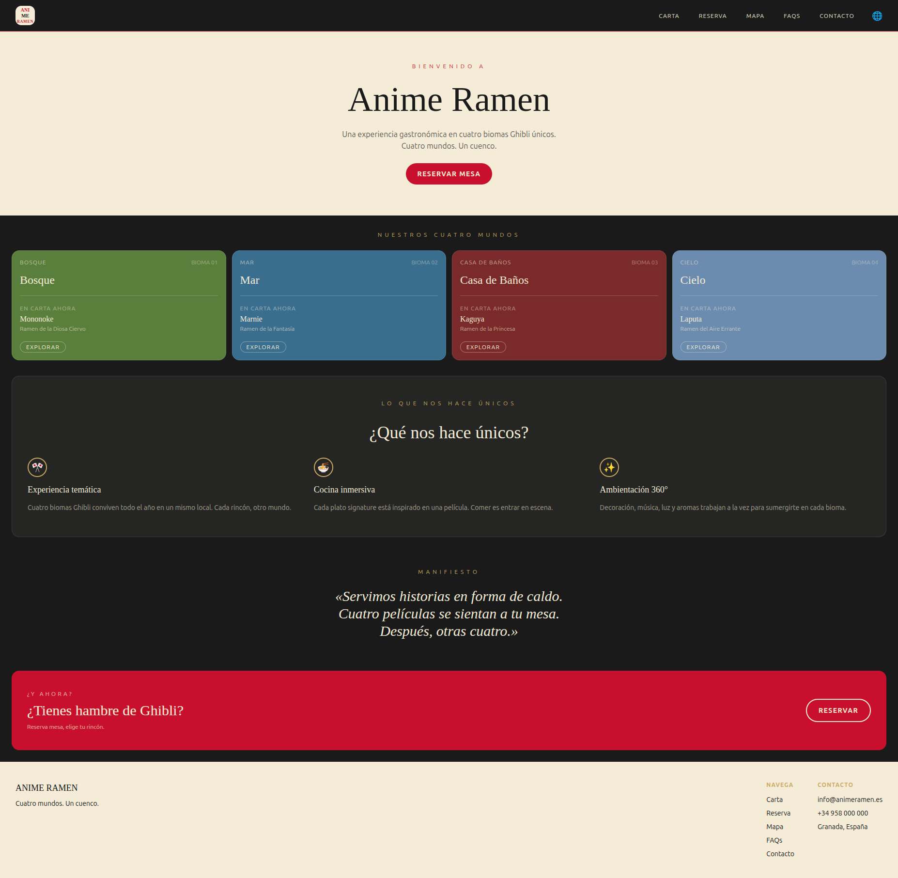
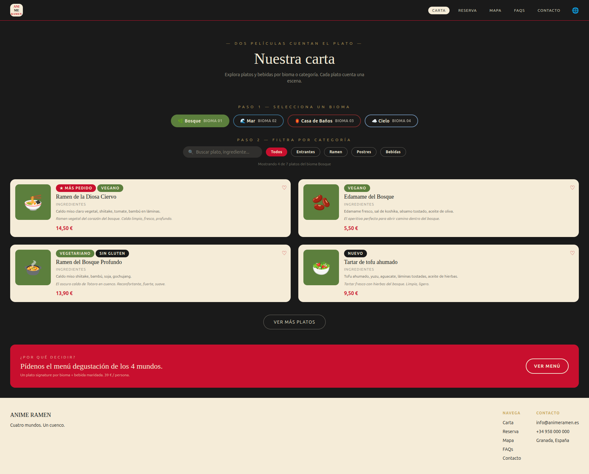
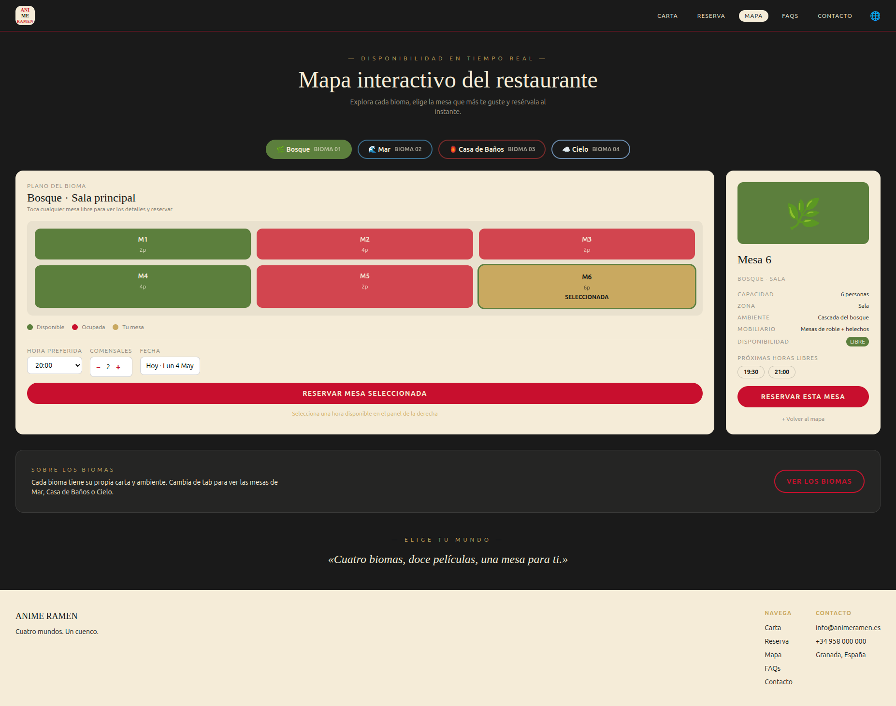
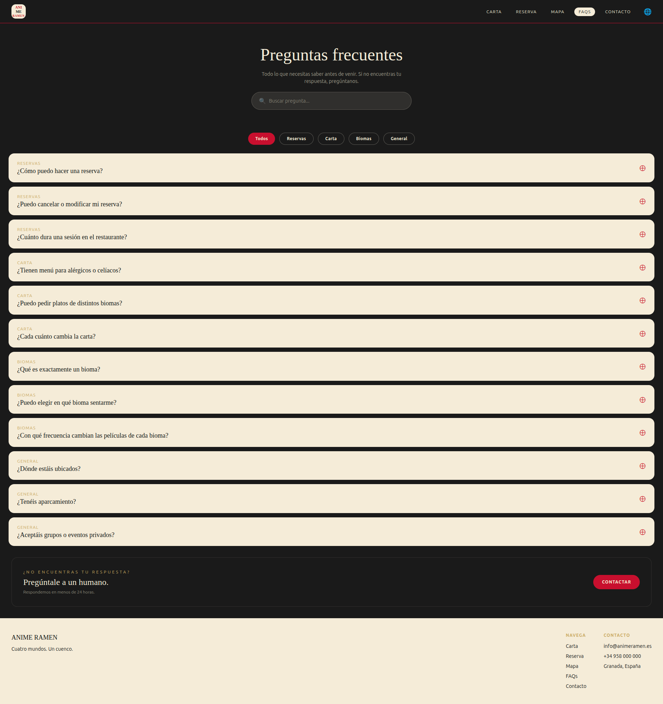
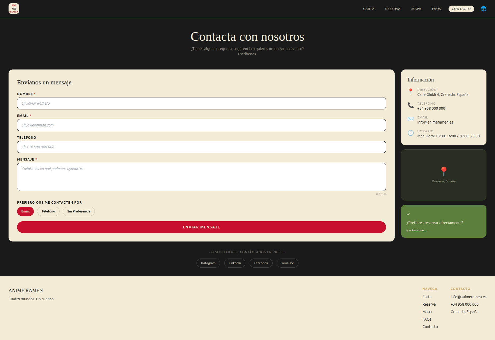

# DIU26
Prácticas Diseño Interfaces de Usuario (Tema: .... ) 

* [Guiones de prácticas](GuionesPracticas/)
* [Guía para crea tu Case Study](Guia_CaseStudy.md)
* Sala de la Fama [DIU Hall of fame](https://github.com/mgea/DIU/tree/master/hall_of_fame) donde se pueden encontrar Case Study destacados de otros años.

Actualizado: 14/01/2026

Grupo: DIU1.HustleHard  Curso: 2025/26 

Nombre del Proyecto: 

Nombre Proyecto: Ghibli Experience

Descripción: 

Nuestra propuesta consiste en la creación de un restaurante inspirado en el universo creativo de Hayao Miyazaki y las peliculas de Studio Ghibli. El concepto del restaurante gira entorno a cuatro peliculas diferentes, ofrenciendo a los clientes la posibilidad de elegir la experiencia que desean vivir según su personalidad y estado de ánimo en el que se encuentren. No solo tratará de un simple restaurante convencional basado en decoración superficial, sino  en un espacio con coherencia narrativa y estética, donde cada ambiente represente un "bioma" inspirado en una película concreta.
Cada uno de estos espacios contará con una ambientación propia, una zona diferenciada y un menú especial inspirado en la obra correspondiente. Además, los clientes podrán elegir cualquier plato de la carta general, pero también tendrán la opción de disfrutar de platos exclusivos vinculados a la experiencia seleccionada. Todas estas experiencias diferentes reflejarán también la temática y sentimientos de la película.

Logotipo: 

(Logo y eslogan desarrollados en la práctica 3)

Miembros y nombre del equipo:
 * :bust_in_silhouette:  [Javier Romero Gálvez](https://github.com/JavierRG6) :octocat:     
 * :bust_in_silhouette:  [Pablo Antonio Caballero Carmona](https://github.com/pabloacaballer) :octocat:
----- 

 

# Proceso de Diseño 

 

## Paso 1. UX User & Desk Research & Analisis 

### 1.a User Reseach Plan
 
-----

Nuestro proyecto se centra en el análisis de la hostelería temática, concretamente en la unión de la gastronomía japonesa con la cultura del anime en el contexto de Granada 2031. Investigaremos cómo los usuarios interactúan con plataformas que ofrecen una inmersión cultural, identificando motivaciones y barreras de los "otakus" y turistas. El objetivo es evaluar si la interfaz de **Anime Ramen** comunica su valor diferencial frente a competidores como **Ramen Dojo**. Buscamos optimizar el flujo de reserva y consulta de carta para convertir una necesidad básica (comer) en una experiencia de usuario memorable, eficiente y alineada con la innovación hostelera.

### Objetivos generales + KPI's o Métricas

| Objetivos | KPI's / Métricas |
| :--- | :--- |
| **Aumentar la conversión de reservas** en el restaurante temático | - Tasa de finalización del formulario de reserva   - Número de reservas confirmadas vía web mensual |
| **Consolidar el sentimiento de comunidad** "Anime & Food" | - Número de registros en el club de fidelidad/newsletter   - Interacciones en la sección de eventos culturales |
| **Evaluar la eficacia del diseño visual** temático | - Tiempo promedio de permanencia en la galería de platos   - Tasa de rebote en la página de inicio |
| **Medir la satisfacción de la experiencia** de usuario digital | - Puntuación media en encuestas de satisfacción (CSAT)   - Ratio de clics (CTR) en el menú digital interactivo |

---

### Información cualitativa y cuantitativa
A continuación definiremos los métodos para obtenerlos:

#### Información cualitativa:
* **Análisis Heurístico:** Realizaremos una inspección de la interfaz basada en los principios de usabilidad para detectar fallos de diseño y navegación.
* **Entrevistas en profundidad:** Hablaremos con usuarios habituales de restaurantes temáticos para entender qué valoran más (ambientación, rapidez, fidelidad al anime).
* **Pruebas de usabilidad:** Evaluaremos la facilidad de uso de las funcionalidades clave (reserva y menú) obteniendo feedback directo.

#### Información cuantitativa:
* **Encuestas de satisfacción:** Realizaremos cuestionarios para medir el agrado de los usuarios durante la navegación y su interés por la temática anime.
* **Análisis de métricas:** Mediremos parámetros como el tiempo promedio de permanencia o la tasa de abandono en el proceso de reserva.
* **Cuestionarios SUS:** Aplicaremos la escala *System Usability Scale* para obtener un valor numérico sobre la facilidad de uso del sistema.

### 1.b Competitive Analysis
 
-----

Hemos decidido centrarnos en la web de Anime Ramen. Consideramos que, aunque tiene una propuesta visual potente, presenta oportunidades de mejora en la fluidez de reserva y la jerarquía de información frente a sus competidores. Analizaremos esta plataforma frente a Ramen Dojo, que destaca por su integración de comunidad y eventos, y Akiba (o similar), un referente en el sector de restauración tematizada con un flujo de usuario muy pulido.

Nuestro objetivo es detectar áreas de mejora en la usabilidad de Anime Ramen tomando como referencia los puntos fuertes de la competencia, especialmente en la claridad del menú y la eficiencia del sistema de reservas.

- https://animeramen.com/
- https://ramendojo.org/
- https://www.ramenshifu.com/

**Análisis Competitivo:**

### 1.c Personas
 
----- 

Alejandro es una persona muy metódica y exigente. Es ingeniero de software, y fanático del cine Japonés. Su comportamiento se define por la busqueda de la eficiencia y simplicidad. Alejandro buscaba un nuevo restaurante que probar de su comida favorita, aun siendo introvertido se lanzó a probar Anime ... debido a su canal digital. Su interés por el cine Japonés y el anime no es solo por lo estético, si no también por lo estructural, le motiva la construcción de mundos. Para Alejandro el restaurante funciona como un momento de desconexión en el que la calidad del producto, el servicio y la fácil manejabilidad de las "herramientas" le hacen descansar de su mente metódica y sus días agotadores. No perdona errores en la ejecución pero que se convierte en un cliente usual si el establecimiento está a la altura de sus expectativas.

Martina como estudiante de bellas artes, por lo que es el tipo de persona que busca en la gastronomia una extensión de su identidad, es decir que busca que el local encaje con como ella se ve a sí misma. Para Martina el restaurante es un sitio de inspiración donde su principal punto de atracción es el storytelling inspirado en la estetica slice of life de obras de Miyazaki. Como usuaria introvertida, busca sitios con poco ruido que le permitan concentración e introspección mientras consume. Es un usuario que prioriza la coherencia y la atmosfera que transmite el local a la rapidez y facilidad del servicio, buscando experiencias que la hagan sentir en "casa". 

### 1.d User Journey Map
 
----

 Su experiencia ha sido positiva, sobre todo porque la web le ha agradado y también ha podido disfrutar de su plato favorito uniendolo a su hobbit por el anime.
 

Su experiencia destaca por la transformación emocional: llega con un bloqueo creativo y encuentra en la atmósfera inmersiva del local la inspiración que necesitaba. La clave de su éxito es la coherencia entre la narrativa visual y el producto, logrando que se sienta "fuera de la ciudad"

### 1.e Usability Review
 
----

Enlace al documento: [Análisis de Usabilidad - Ramen Dojo](./P1/Usability-review-RamenDojo.xlsx)

URL y Valoración numérica obtenida: https://ramendojo.org/ — 66/100 (Moderate)

**Resultado del análisis:**

Comentario sobre la revisión:
Tras realizar el análisis de usabilidad de Ramen Dojo, se ha obtenido una calificación moderada. Como punto fuerte destaca su excelente estética inmersiva, que conecta perfectamente con el público objetivo mediante el uso de recursos visuales del mundo anime. Sin embargo, se han detectado varios puntos débiles que afectan a la experiencia: la navegación es inconsistente en algunos apartados, falta un buscador interno y los formularios de interacción no ofrecen un feedback claro al usuario. Además, se observa una falta de ayudas o guías para usuarios novatos, lo que justifica la necesidad de una propuesta de mejora en el diseño de la interfaz.

 

## Paso 2. UX Design  

### 2.a Reframing / IDEACION: Feedback Capture Grid / EMpathy map 
 
----

### 2.b ScopeCanvas

----

### PROPUESTA DE VALOR
Nuestro propósito principal con la renovación de Anime Ramen es transformar un restaurante temático convencional en una experiencia de inmersión total inspirada en los mundos de Studio Ghibli y Hayao Miyazaki. Queremos ir más allá de la típica decoración "de cartón piedra" para ofrecer un refugio donde la gastronomía, el diseño y la tranquilidad se unan.

Nuestra propuesta de valor ataca directamente las frustraciones más comunes de los usuarios: los locales frikis ruidosos, la comida que no cumple las expectativas visuales y la incertidumbre de no saber dónde te van a sentar. Para solucionarlo, el núcleo de nuestro proyecto es un sistema de reserva web basado en "Biomas". De esta forma, el usuario puede elegir desde su móvil el ambiente exacto que encaja con su mood (ya sea para estar de chill o con amigos) y explorar una carta digital interactiva que cuenta la historia de cada plato.

Para alinear todas estas necesidades de los usuarios con nuestros objetivos de negocio (tanto a corto como a largo plazo), hemos desarrollado el siguiente Scope Canvas. Esta herramienta nos ha servido como hoja de ruta para definir las acciones concretas que buscamos en nuestros clientes y las métricas que determinarán el éxito del proyecto:

### 2.b User Flow (task) analysis 
 
-----

En nuestra matriz de tareas de usuario, hemos recopilado las funciones de nuestra web y como de relevante serian para cada tipo de usuario, hemos añadido cinco tipos de usuarios, dando las prioridades de alta(H), media(M) y baja(L):

Y hemos mostrado el flujo de la tarea que consideramos mas importante: 

FLUJO DE RESERVA DE MESA

### 2.c IA: Sitemap + Labelling 
 
----

### Labelling del Sitemap

| Web | Información | Referencia |
|---|---|---|
| **Página de Inicio** | La portada donde aterrizas. Te da la bienvenida y te resume de qué va el proyecto. | 🌐 |
| **Carta** | Nuestro catálogo principal. Aquí se puede ver de un vistazo toda la oferta que tenemos montada. | 📖 |
| **Participantes** | Para saber quién es quién. Muestra la información de la gente o proyectos que colaboran. | 👥 |
| **Biomas** | La categoría principal que agrupa todo por ecosistemas o temáticas para que esté bien organizado. | 🌿 |
| **Bioma 1** | Sección dedicada al primer entorno (ej. zona de bosque) con sus detalles específicos. | 🌳 |
| **Bioma 2** | Sección dedicada al segundo entorno (ej. zona árida/desierto). | 🏜️ |
| **Bioma 3** | Sección dedicada al tercer entorno (ej. zona acuática). | 🌊 |
| **Bioma 4** | Sección dedicada al cuarto entorno (ej. zona fría/nieve). | ❄️ |
| **Filtros** | Para que el usuario no se vuelva loco buscando y vaya directo al grano según lo que le interese. | 🔍 |
| **Mapa Interactivo** | El plano para que la gente cotillee el recinto, se ubique y sepa dónde está cada cosa. | 🗺️ |
| **Reservas** | El apartado principal para pillar sitio antes de ir. | 🗓️ |
| **Selección de Mesa** | El croquis visual donde eliges exactamente en qué silla te quieres sentar. | 🪑 |
| **Horario** | Para marcar el tramo de horas que mejor te venga y ver qué hay libre. | 📅 |
| **Confirmación de Reserva**| La pantalla de éxito que te suelta el "¡Todo listo!" y te da el ticket o QR. | ✅ |
| **FAQs** | Las típicas dudas que tiene todo el mundo, respondidas aquí para ahorrar tiempo. | ❓ |
| **Contacto** | Por si se quedan con alguna duda más rara y necesitan mandarnos un correo o llamarnos. | 📮 |

### 2.d Wireframes
 
-----

Esquema visual de la pantalla de inicio para dispositivos móviles, diseñado como reflejo directo del Sitemap del proyecto. La interfaz prioriza la accesibilidad y la claridad visual mediante un menú de navegación fijo superior, facilitando la exploración inmediata de la Carta, las distintas categorías de Biomas y las herramientas de filtrado y búsqueda.

 

#### 1. Página Principal

Esquema visual de la pantalla de inicio para ordenador y el de todas las subsecciones, diseñado como reflejo directo del Sitemap del proyecto. La interfaz prioriza la accesibilidad y la claridad visual mediante un menú de navegación fijo, facilitando la exploración inmediata de la Carta, las distintas categorías de Biomas y las herramientas de filtrado y búsqueda.
 

  

#### 2. Área de Biomas (Carta)

Pantalla de exploración del catálogo gastronómico, organizada por biomas y categorías. Incluye sistema de filtrado, buscador y visualización de platos con nombre, descripción y precio. 
  

 

#### 3. Área de Reserva

Flujo de reserva estructurado en cuatro pasos: selección de fecha, hora y comensales; elección de bioma; selección de mesa en plano interactivo; y pantalla de confirmación con referencia de  reserva.
 
  

 

#### 4. Área del Mapa Interactivo

Vista general del restaurante con representación visual de los cuatro biomas y sus mesas. Permite al usuario explorar la disponibilidad en tiempo real y acceder directamente al flujo de reserva desde el propio plano.
 
  

 

#### 5. Área de Preguntas (FAQs)

Sección de preguntas frecuentes con buscador integrado y filtrado por categorías. Las respuestas se despliegan en formato acordeón para facilitar la lectura y reducir la carga visual.
 

 

#### 6. Área de Contacto 

Formulario de contacto con campos de nombre, email, motivo de consulta y mensaje, acompañado de información del local, horarios y mapa de ubicación. Incluye estado de confirmación tras el envío.
 
  

 

## Paso 3. Mi UX-Case Study (diseño)

### 3.a Moodboard

-----

Para definir la identidad visual del proyecto, elaboramos un moodboard que recoge los principales referentes estéticos y de diseño. A partir de él establecimos la paleta de colores, la tipografía y el estilo visual general que guiaría el resto del proceso de diseño.

### 3.b Landing Page
 
----

Diseñamos una landing page orientada a captar la atención del usuario desde el primer momento. El objetivo era transmitir de forma clara qué es Anime Ramen y por qué merece la pena visitarlo, priorizando una estructura sencilla y un llamada a la acción visible.

### 3.c Guidelines
 
----

Para el desarrollo del prototipo Hi-Fi de Anime Ramen (versión escritorio), hemos aplicado la metodología Atomic Design y los principios fundamentales de Material Design 3 para construir un sistema de diseño coherente, escalable y accesible. El estudio se complementa con las directrices WCAG 2.2 (accesibilidad), las heurísticas de usabilidad de Nielsen y las convenciones de diseño responsive mobile-first, asegurando que el sistema final sea robusto y profesional.
Herramientas y Recursos base

Material Theme Builder: Hemos utilizado este plugin para generar nuestra paleta tonal a partir de los colores del moodboard (Rojo Ramen y Tinta Sumi como key colors), garantizando matemáticamente un contraste óptimo entre fondos y textos para cumplir con los estándares de accesibilidad WCAG 2.2 AA.

Material Symbols: Empleado para integrar iconografía estandarizada y reconocible (búsqueda, calendario, reloj, ubicación, correo, idioma, redes sociales, navegación, favorito, check de confirmación).

Figma Auto Layout: Todo el sistema se construye con Auto Layout (incluyendo la función Wrap) para asegurar un comportamiento responsive fluido y permitir reutilizar componentes a través de distintas pantallas con un único cambio.

Google Fonts: DM Serif Display y Noto Serif JP cargadas como tipografías de marca, ambas open source y con buena cobertura para latín y kanji japonés (logo + acentos culturales).

Figma Community & Plugins: Uso de plugins como Unsplash y UI Faces para enriquecer los mockups con imágenes reales (platos, interiores, avatares de usuario en testimonios).

Paleta de Colores (Accesibilidad y Contraste) Se han asignado roles estrictos a cada color siguiendo el sistema de tokens de Material Design 3, alcanzando un ratio de contraste de 13:1 entre la pareja Cream/Sumi (muy por encima del 4.5:1 mínimo exigido por WCAG):

Primary (Rojo Ramen - #C8102E): Reservado exclusivamente para botones, llamadas a la acción (Call to Action), elementos del logo y acentos visuales clave (eyebrows, precios, badges destacados). El texto en su interior utiliza el token On Primary (cream #F4ECD8) para maximizar el contraste.

Background / Surface (Tatami Cream - #F4ECD8): Lienzo principal de cards y contenido. Transmite calidez, papel washi y la sensación cálida de un izakaya tradicional.

Surface inverso (Tinta Sumi - #1A1A1A): Fondo de página principal, hero sin card y CTA secundario nocturno. Refuerza la atmósfera cinematográfica e inmersiva del local.

On Background / On Surface (Sumi sobre cream y cream sobre sumi): Aplicado a todos los textos e iconos para asegurar una lectura perfecta y sin fatiga visual.

Secondary (Oro Hanko - #C9A961): Inspirado en los sellos hanko japoneses. Usado para detalles de marca, eyebrow text, divisores, badges editoriales y la franja vertical decorativa de las cards de información.

Acentos por bioma Cada uno de los cuatro mundos Ghibli del concepto tiene un color de acento propio que se aplica de forma consistente en toda la web (tabs de bioma, etiquetas de plato, bordes de cards, colores de filtro, fondos de cabecera de tarjeta y micro-interacciones), creando un sistema de codificación visual instantáneo:

Verde Bambú (#5B7F3D) — bioma Bosque (Primavera).
Azul Profundo (#3B6E8F) — bioma Mar (Verano).
Granate Lacado (#7A2A2A) — bioma Casa de Baños (Otoño).
Azul Bruma (#6B8CAE) — bioma Cielo (Invierno).

Paleta de estados (sistema funcional) Comunicación visual instantánea para feedback de sistema:

Verde Bosque (#5B7F3D) para estados positivos: mesa libre, mensaje enviado, paso completado.
Rojo Primary (#C8102E) para alertas y ocupado.
Oro Hanko (#C9A961) para selección actual.
Tinta Sumi (#1A1A1A) para estados neutros.

Tipografía

DM Serif Display (Serif): Utilizada en titulares, encabezados (H1, H2) y nombres de plato. Refuerza la identidad editorial y cinematográfica de Studio Ghibli con remates clásicos sin caer en lo pomposo.

Noto Serif JP (Serif japonés): Empleada en kanji decorativos del logo (anime ramen 漫拉) y acentos culturales puntuales. Open source, con cobertura completa de caracteres japoneses.

Helvetica / Inter (Sans-Serif): Aplicada a textos de cuerpo, navegación, micro-copy, etiquetas, formularios y números (precios, horarios). Aporta limpieza y legibilidad en entornos digitales con tamaños pequeños.
Tono de voz: Poético pero terrenal. Frases cortas. Comida con alma. Eyebrows en mayúsculas con letter-spacing 4-6 para crear ritmo editorial.

Iconografía Iconos lineales 1.5-2px de grosor, esquinas ligeramente redondeadas, todos en On Surface (sumi sobre cream o cream sobre sumi). Familias usadas:

Material Symbols Outlined para sistema (búsqueda, menú, calendario, reloj, ubicación, correo, teléfono, check, chevron, plus/minus).
Set custom de redes sociales en cuadrados rounded 12px de Material 3.
Emojis de bioma (🌿 Bosque · 🌊 Mar · 🏮 Casa de Baños · ☁️ Cielo) como anclas visuales rápidas en navegación, tabs y badges. Reemplazables por iconos custom en producción.
Kanji decorativos (夢 sueño · 食 comida) usados como sello de marca en hero y CTAs principales — equivalente al "hanko" japonés.

Patrones UI Aplicados (UI Patterns) y Comportamiento Todo el diseño se ha estructurado utilizando Auto Layout en Figma para asegurar un comportamiento responsive fluido en pantallas de escritorio (1440px), con previsión de adaptarse a tablet (768px) y móvil (375px) en la fase de prototipado.

Top App Bar (Header) & Fat Footer: Elementos de navegación persistentes en todas las pantallas. El Header (sumi sobre fondo negro, 80px de alto) agrupa logotipo, menú principal con cinco entradas (Carta, Reservar, Mapa Interactivo, FAQs, Contacto), un selector de idioma y la sección activa marcada con un pill cream. El Footer, card cream rounded de 220px, cierra la estructura con tagline, columnas de enlaces legales y de utilidad, datos de contacto y red de iconos sociales en cuadrícula 2x2.

Hero Pattern Editorial: Cabecera sin card, sobre fondo sumi a pantalla completa, con estructura tripartita: eyebrow oro en mayúsculas con letter-spacing 6, título principal en DM Serif Display (60-80 px) y subtítulo en cursiva. En la home se complementa con CTAs primario (rojo) y secundario (outline cream) más un mosaico 2×2 de los cuatro biomas, ganando presencia cinematográfica al ir directamente sobre el fondo.

Grid Responsivo (Wrap): Uso avanzado de la función Wrap de Auto Layout en los catálogos de biomas (4×1 en home, 2×2 en moodboard), platos de la carta (2×2) y testimoniales para crear cuadrículas (Grids) de tarjetas que saltan de línea y se adaptan automáticamente al ancho disponible. Cada tarjeta mantiene proporciones consistentes con shape token de 24px de radio (Material 3 "Large").

Stepper / Wizard de 4 pasos: El flujo de Reserva está dividido en cuatro pasos siguiendo el patrón Wizard (Fecha y comensales → Bioma → Mesa → Confirmación). Un stepper persistente muestra el estado de cada paso con tres variantes visuales (completado en cream con check verde, activo en rojo con número, futuro en outline cream con número), reduciendo la carga cognitiva y aplicando la heurística de Nielsen "reconocimiento mejor que recuerdo".

Búsqueda y Filtros (Tabs y Pill Chips): Implementación de barras de búsqueda combinadas con "Chips" (pills rounded) para facilitar la exploración y el filtrado en las vistas de Carta, FAQs y Mapa Interactivo. La pill activa lleva fondo de color (rojo Primary o color del bioma) y la inactiva queda como outlined cream, complementada con atajo de teclado ⌘K visible — patrón típico de productos modernos como Linear o Notion.

Accordion (FAQ): La sección de Preguntas Frecuentes usa el patrón acordeón con un único item expandible a la vez. Cabeceras en DM Serif con eyebrow del color de la categoría y toggle visual claro (círculo outline + ⊕ cerrado / círculo sumi + ⊖ abierto), aplicando el principio de información progresiva.

Two-column Layout (60/40): Páginas con formulario más información complementaria (Contacto, Mapa Interactivo en escritorio) usan grid de dos columnas con proporción 60/40, donde la columna mayor lleva el contenido principal (formulario, plano interactivo) y la menor el contexto (info de contacto, panel de detalle de mesa). En tablet y móvil colapsa a una sola columna.

Formularios con Estados: Inputs blancos con borde sumi 1.5px, esquinas rounded 10px, label superior en mayúsculas con letter-spacing 2 e indicador de obligatoriedad (*), placeholder en gris cursiva con ejemplo realista e iconografía contextual a la izquierda (calendario, reloj). Stepper numérico personalizado (− número +) para campos cuantitativos como comensales y textarea con contador de caracteres alineado a la derecha.

Color-coded States en mapa interactivo: El plano del restaurante usa codificación visual estricta (verde Bosque para mesas disponibles, rojo Primary para ocupadas, oro Hanko con anillo punteado para la mesa actualmente seleccionada), cumpliendo la heurística de Nielsen "visibilidad del estado del sistema" — el usuario sabe en cualquier momento qué puede o no puede hacer.

Status Pills y Badges editoriales: Pills rounded 22px con label en mayúsculas y letter-spacing aplicadas a etiquetas de plato (VEGANO, SIN GLUTEN, NUEVO, SIGNATURE, ★ MÁS PEDIDO) y a estados (LIBRE, OCUPADA, TEMPORADA ACTIVA), con colores de fondo coherentes con la paleta del sistema (verde para positivos, rojo para alertas, oro para premium).

Success / Empty States: Estados de finalización con feedback visual fuerte mediante bloque verde Bosque a ancho completo con check icono cream gigante, headline en DM Serif y referencia de la operación visible (#AR-2026-0042), siguiendo la heurística "feedback claro" de Nielsen y previniendo la ansiedad post-acción del usuario.

Hero CTA secundario (bloque rojo de cierre): Antes del footer, un CTA full-bleed en rojo Primary refuerza la conversión ("¿Tienes hambre de Ghibli?", "Pregúntale a un humano", "Pídenos el menú degustación"). Botón secundario sumi sobre rojo, patrón típico en e-commerce y hostelería para empujar al usuario al final del scroll.

Microinteracciones y Estados Aunque la fase de prototipado profundizará en las animaciones, el sistema de diseño ya prevé los siguientes estados que se implementarán con Smart Animate de Figma:

Hover en cards: aumento sutil de la sombra (elevación) más ligero scale 1.02 para dar feedback de interactividad al usuario.
Hover en botones primarios: oscurecimiento del 10% del color base más aumento de elevación.
Focus en inputs: borde rojo Primary 2px y label que sube animadamente (floating label).
Transición entre pasos del Wizard de Reserva: slide horizontal con Smart Animate manteniendo el stepper en su sitio.
Apertura de acordeón: altura animada con easing cubic-bezier(0.4, 0, 0.2, 1) — Material standard easing.
Selección de mesa en el plano: scale más cambio de color a oro con ring punteado animado.
Confirmación de reserva: check icono dibujándose con stroke-dasharray y bloque verde apareciendo desde abajo.

Conclusión Este sistema de diseño combina el rigor técnico de Material Design 3 (escalabilidad, accesibilidad, tokens de color y elevación) con la identidad editorial fuerte que pide el concepto de Anime Ramen (cuatro mundos Ghibli, tipografía editorial, paleta cálida con acentos por bioma). El uso disciplinado de Atomic Design — átomos (colores, tipografías, iconos), moléculas (input + label, card de plato), organismos (header, footer, formulario completo) — garantiza que el prototipo Hi-Fi de la siguiente fase sea consistente, escalable y profesional. Todas las decisiones documentadas se aplican uniformemente a las siete pantallas diseñadas (Home, Carta, Mapa Interactivo, FAQs, Contacto y los cuatro pasos del flujo de Reserva), formando un sistema cohesionado que responde tanto a las heurísticas de usabilidad como a la identidad de marca del proyecto.
### 3.d Mockup
 
----

A partir de los guidelines definidos, desarrollamos el mockup de alta fidelidad en Figma. Las pantallas cubren los flujos principales de la aplicación: navegación por la carta, proceso de reserva paso a paso, mapa interactivo, FAQs y contacto. Se han tenido en cuenta aspectos como la consistencia visual, la jerarquía de la información y la usabilidad en móvil.

#### 1. Landing Page (Inicio)

 

#### 2. Nuestra Carta

 

#### 3. Reserva 

El proceso de reserva se divide en 4 pasos para simplificar la experiencia del usuario y reducir la carga cognitiva en cada pantalla.

##### Paso 1:

 

##### Paso 2: 

 

##### Paso 3: 

 

##### Paso 4

 

#### Mapa Interactivo

 

#### FAQs (preguntas frecuentes)

 

#### Contacto

 

---

Enlace al Prototipo Interactivo: Puedes navegar por la versión interactiva y probar las animaciones, estados hover y la navegación entre pantallas directamente en Figma a través del siguiente enlace: 👉 [Ver Prototipo Interactivo en Figma](https://www.figma.com/proto/waJHVowmzAK5YK8yJwvYkh/Mockup_principal?node-id=1-308&p=f&t=2KEITyGYh89mQHJ3-1&scaling=min-zoom&content-scaling=fixed&page-id=0%3A1&starting-point-node-id=1%3A308)
 

## Paso 4. Exportación y Documentación

### 4.a Exportación a HTML/React

----

El objetivo de esta fase ha sido transformar los diseños visuales y prototipos elaborados en Figma a un proyecto web funcional construido con **React (Vite, JavaScript y Tailwind CSS)**.

Para llevar a cabo esta tarea, optamos por la **opción 1C — Generación directa en React**, construyendo los componentes desde cero tomando como referencia el prototipo de Figma y el Design System definido en la práctica anterior:

1. **Construcción de componentes atómicos:** Se crearon los átomos del sistema (`Button`, `Badge`, `Logo`, `FormField`), las moléculas (`Navbar`, `Footer`, `Stepper`, `CardPlato`) y los organismos (páginas completas como `Reserva`, `Carta` o `Mapa`), siguiendo estrictamente la metodología **Atomic Design**.
2. **Sistema de estilos con Tailwind CSS v3:** Se trasladó fielmente la paleta de colores, tipografía y tokens de diseño del Design System de Figma a clases utilitarias de Tailwind, respetando los roles semánticos de cada color (Ramen Rojo `#C8102E`, Tatami Cream `#F4ECD8`, Tinta Sumi `#1A1A1A`, Oro Hanko `#C9A961` y los cuatro colores de bioma).
3. **Navegación sin router externo:** Se implementó un sistema de navegación mediante `useState` en `App.jsx`, gestionando la vista activa y pasando la función `onNavegar` como prop a todos los componentes, lo que permite transitar entre las seis páginas sin necesidad de React Router.
4. **Interactividad real:** Se implementó lógica funcional en todas las vistas: filtrado por bioma y categoría en la Carta, selección de mesa con codificación por color en el Mapa, flujo de reserva en 4 pasos con validación de campos obligatorios, acordeón en FAQs y formulario con estado de envío en Contacto. Además, el Mapa pasa los datos de mesa seleccionada directamente a la Reserva.

> **Nota sobre la ubicación del código:** Todo el código fuente de la aplicación React se encuentra en el directorio `P4/anime-ramen/` de este repositorio. La WebApp está desplegada de forma optativa en Surge.sh: [https://anime-ramen-ugr.surge.sh](https://anime-ramen-ugr.surge.sh)

#### Resultado Visual de las Páginas Ensambladas

  
   
  <i>Página principal (Landing Page)</i>

 

  
   
  <i>Página de la carta con filtros por bioma y categoría</i>

 

  
   
  <i>Flujo de reserva — Paso 1: Fecha, hora y comensales</i>

 

  
   
  <i>Flujo de reserva — Paso 2: Elección de bioma</i>

 

  
   
  <i>Flujo de reserva — Paso 3: Selección de mesa</i>

 

  
   
  <i>Flujo de reserva — Paso 4: Confirmación</i>

 

  
   
  <i>Mapa interactivo del restaurante con selección de mesa</i>

 

  
   
  <i>Página de preguntas frecuentes con acordeón y filtros</i>

 

  
   
  <i>Página de contacto con formulario interactivo</i>

 

---

### 4.b Documentación con Storybook

----

Dado que hemos construido nuestra interfaz basándonos en la metodología de **Diseño Atómico**, se instaló y configuró **Storybook 10** dentro del proyecto para documentar visualmente los componentes del sistema de diseño.

Se crearon historias (`.stories.jsx`) para los siguientes componentes:

| Componente | Variantes documentadas |
|---|---|
| `Button` | Primary, Secondary, Outline |
| `Badge` | Rojo, Verde, Oro, Sumi |
| `Navbar` | Activo en cada sección |
| `Footer` | Default |
| `CardPlato` | Default, Signature |
| `Stepper` | Paso 1, 2, 3, Completado |
| `FormField` | Default, Email |
| `Logo` | Small, Medium, Large |

Storybook está disponible ejecutando `npm run storybook` desde la carpeta `/anime-ramen`.

---

### 4.c Briefing del proceso

----

Para la migración del diseño de Figma a producción se optó por la **opción 1C**, construyendo los componentes directamente en React partiendo del sistema de diseño definido en la práctica anterior. Se utilizó **Vite** como bundler, **React** como framework y **Tailwind CSS v3** para los estilos, respetando fielmente la paleta de colores, tipografía y tokens de diseño del sistema Atomic Design desarrollado en Figma.

Se trasladaron al código todos los elementos definidos en el Design System: la paleta tonal completa con sus roles semánticos, la jerarquía tipográfica (DM Serif Display para titulares, Inter para cuerpo), los patrones UI (Stepper de 4 pasos en la reserva, acordeón en FAQs, grid de mesas con codificación por color, tabs de bioma, badges y pills), los estados de los componentes (hover, seleccionado, deshabilitado, error de validación) y el layout responsive con Flexbox y CSS Grid de Tailwind.

El principal problema encontrado fue la incompatibilidad de **Tailwind CSS v4** con el sistema de plugins de PostCSS, lo que obligó a degradar a la versión estable v3. También se detectó un problema de versión de Node.js (v18 instalada, v20 requerida por Vite 9), resuelto mediante la instalación de **nvm**. Adicionalmente, la página aparecía en blanco al acceder a la URL de Surge por problemas de routing en cliente, solucionado copiando `index.html` como `200.html` antes del despliegue.

## Paso 5. Pruebas de Evaluación 

### 5.a Reclutamiento de usuarios 

-----

>>> Breve descripción del caso asignado (llamado Caso-B) con enlace al repositorio Github
>>> Tabla y asignación de personas ficticias (o reales) a las pruebas. Exprese las ideas de posibles situaciones conflictivas de esa persona en las propuestas evaluadas. Mínimo 4 usuarios: asigne 2 al Caso A y 2 al caso B.

| Usuarios | Sexo/Edad     | Ocupación   |  Exp.TIC    | Personalidad | Plataforma | Caso
| ------------- | -------- | ----------- | ----------- | -----------  | ---------- | ----
| User1's name  | H / 18   | Estudiante  | Media       | Introvertido | Web.       | A 
| User2's name  | H / 18   | Estudiante  | Media       | Timido       | Web        | A 
| User3's name  | M / 35   | Abogado     | Baja        | Emocional    | móvil      | B 
| User4's name  | H / 18   | Estudiante  | Media       | Racional     | Web        | B 

### 5.b Diseño de las pruebas 
 
-----

>>> Planifique qué pruebas se van a desarrollar. ¿En qué consisten? ¿Se hará uso del checklist de la P1?

### 5.c Cuestionario SUS
 
----

>>> Como uno de los test para la prueba A/B testing, usaremos el **Cuestionario SUS** que permite valorar la satisfacción de cada usuario con el diseño utilizado (casos A o B). Para calcular la valoración numérica y la etiqueta linguistica resultante usamos la [hoja de cálculo](https://github.com/mgea/DIU19/blob/master/Cuestionario%20SUS%20DIU.xlsx). Previamente conozca en qué consiste la escala SUS y cómo se interpretan sus resultados
http://usabilitygeek.com/how-to-use-the-system-usability-scale-sus-to-evaluate-the-usability-of-your-website/)
Para más información, consultar aquí sobre la [metodología SUS](https://cui.unige.ch/isi/icle-wiki/_media/ipm:test-suschapt.pdf)
>>> Adjuntar en la carpeta P4/ el excel resultante y describa aquí la valoración personal de los resultados 

### 5.d A/B Testing
 
-----

>>> Los resultados de un A/B testing con 3 pruebas y 2 casos o alternativas daría como resultado una tabla de 3 filas y 2 columnas, además de un resultado agregado global. Especifique con claridad el resultado: qué caso es más usable, A o B?

### 5.e Aplicación del método Eye Tracking 

----

>>> Indica cómo se diseña el experimento y se reclutan los usuarios. Explica la herramienta / uso de gazerecorder.com u otra similar. Aplíquese únicamente al caso B.

  
>>> Cambiar esta img por una de vuestro experimento. El recurso deberá estar subido a la carpeta P4/  

>>> gazerecorder en versión de pruebas puede estar limitada a 3 usuarios para generar mapa de calor (crédito > 0 para que funcione) 

### 5.f Usability Report de B
 
-----

>>> Añadir report de usabilidad para práctica B (la de los compañeros) aportando resultados y valoración de cada debilidad de usabilidad. 
>>> Enlazar aqui con el archivo subido a P4/ que indica qué equipo evalua a qué otro equipo.

>>> Complementad el Case Study en su Paso 4 con una Valoración personal del equipo sobre esta tarea

 

## Conclusiones finales & Valoración de las prácticas

>>> Opinión FINAL del proceso de desarrollo de diseño siguiendo metodología UX y valoración (positiva /negativa) de los resultados obtenidos. ¿Qué se puede mejorar? Recuerda que este tipo de texto se debe eliminar del template que se os proporciona 

