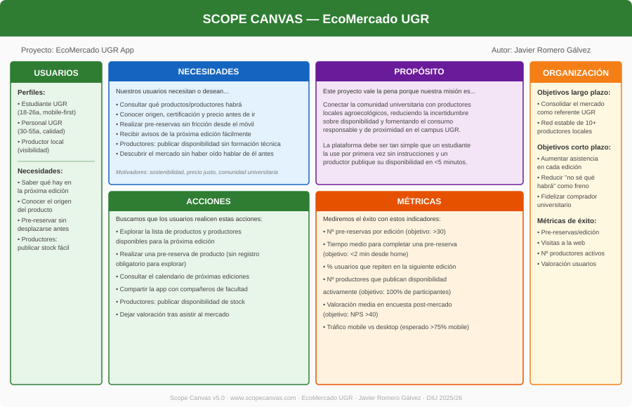
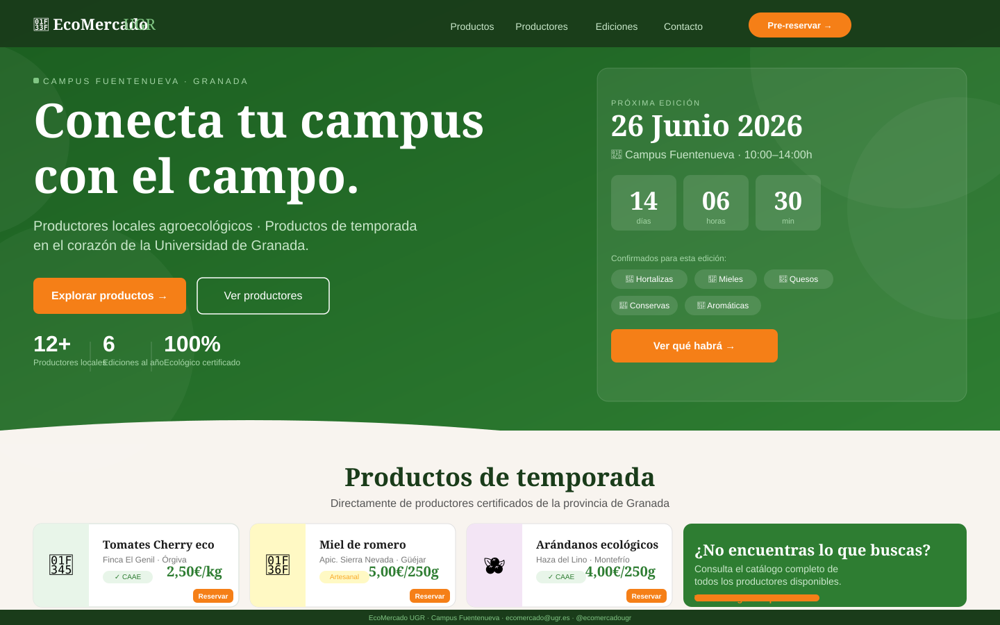
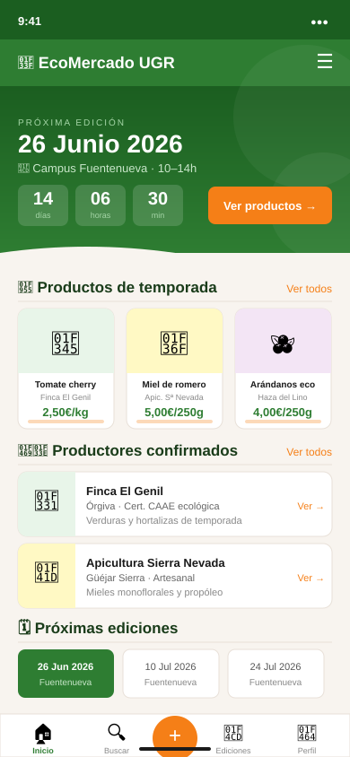
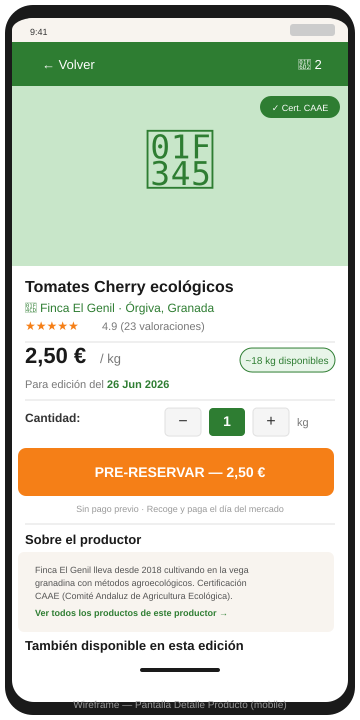
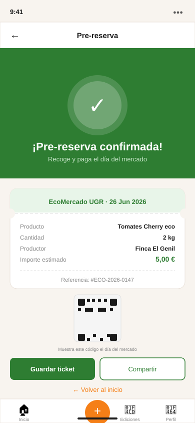

# Trabajo Final: Portfolio UX y resolución de un supuesto práctico
Diseño Interfaces de Usuario - Universidad de Granada

**Javier Romero Gálvez**

Curso: 2025/26

---

## Índice

- [Objetivos](#objetivos)
- [Parte I: Mi experiencia UX](#parte-i-mi-experiencia-ux)
  - [Actividades de clase](#actividades-de-clase)
  - [Prácticas](#prácticas)
- [Parte II: Caso de estudio](#parte-ii-caso-de-estudio)
  - [Introducción](#introducción)
  - [1. Análisis de la web](#1-análisis-de-la-web)
  - [2. Comparativa con otra propuesta](#2-comparativa-con-otra-propuesta)
  - [3. Propuesta de valor](#3-propuesta-de-valor)
  - [4. Análisis final](#4-análisis-final)
- [Conclusión](#conclusión)

---

## Objetivos

El objetivo de este trabajo final es integrar y poner en práctica los conocimientos adquiridos a lo largo del curso de Diseño de Interfaces de Usuario desde dos perspectivas complementarias. Por un lado, un portfolio personal que recoge las aportaciones más relevantes realizadas durante las actividades de clase y las prácticas grupales, acompañado de una reflexión crítica sobre el aprendizaje en UX/UI. Por otro, un caso de estudio práctico sobre un mercado ecológico digital real, aplicando las técnicas y metodologías del diseño centrado en usuario para analizar, comparar y proponer una solución de interfaz para el **EcoMercado UGR**. El trabajo busca conectar teoría y práctica, justificando cada decisión de diseño con criterios objetivos y principios estudiados en la asignatura.

---

# PARTE I: MI EXPERIENCIA UX

## Actividades de clase

A lo largo del curso he aplicado de forma progresiva distintas técnicas del diseño centrado en usuario. A continuación destaco las actividades en las que mi contribución fue más significativa y que han tenido mayor impacto en mi formación UX.

### Actividad 1: Etnografía

El ejercicio etnográfico fue el primero en revelarme la distancia que puede existir entre el modelo mental del usuario y el modelo del sistema, concepto central en el diseño de Norman. Adoptando el rol de observador externo ("GURB"), documenté una situación real y repetida: usuarios interactuando con una máquina de validación de billetes de autobús urbano en Granada. Las personas insertaban el billete por el lado incorrecto, el sistema respondía con un pitido de error sin ninguna retroalimentación visual, y el usuario lo reintentaba varias veces antes de pedir ayuda.

Mi aportación fue identificar que el problema no residía en el usuario sino en un artefacto con **affordances ambiguas**: la ranura de inserción no diferenciaba visualmente la orientación correcta del billete, y el feedback del sistema era exclusivamente sonoro (violando **Nielsen H1: visibilidad del estado del sistema**). Propuse que una señal asimétrica en la ranura o un icono de orientación —soluciones de coste prácticamente nulo— habrían eliminado el conflicto por completo.

**Valoración:** Aprendí a no culpar al usuario y a buscar el error de diseño subyacente. Esta mentalidad es la base del pensamiento UX y ha condicionado positivamente mi forma de analizar interfaces en las actividades posteriores. La calidad de mi aportación fue alta en términos de identificación del problema y propuesta de mejora argumentada.

---

### Actividad 2 / 3: Moodboard — SHOP2 Vintage Rewind

En grupo de cuatro personas (Úrsula Barato, Pablo Antonio Caballero, Tomás Serrano y yo) desarrollamos el moodboard para **Vintage Rewind**, una tienda de moda vintage. Mi aportación específica se centró en la definición tipográfica y en la justificación de la paleta de color desde criterios de percepción y emoción, no desde la preferencia personal.

Argumenté la elección de una combinación *serif + sans-serif*: la fuente con serifa en cabecera transmite lo clásico y auténtico que la marca vintage necesita, mientras que el cuerpo en sans-serif garantiza legibilidad en pantalla. La paleta de tonos tierra y beis con acento terracota se justificó aplicando el **Modelo de Circumplex de Russell**: colores de baja activación y valencia positiva que inducen nostalgia y confort, el objetivo emocional de la marca. La web de inspiración fue analizada con StyleifyMe antes de incorporar sus variables visuales al tablero.

En UX Writing, redacté headlines orientadas a la emoción del usuario ("Ropa con historia. Tuya desde hoy") en lugar de descripciones del producto, aplicando el principio de que el texto de interfaz debe hablar desde las motivaciones del usuario.

- **Figma moodboard + design frames:** [Ver en Figma](https://www.figma.com/design/SUTitpiTdwqGSLyLSw3pJ1/SHOP2?node-id=1-104)
- **Figma Make (diseño responsive):** [Ver prototipo](https://www.figma.com/make/htBYKFuxIi2TOntVwOOjH5/Crear-dise%C3%B1o-responsive?fullscreen=1)

**Valoración:** Aprendí que un moodboard no es una colección estética sino un contrato de coherencia visual que guía todas las decisiones de diseño posteriores. Mi contribución fue de alta calidad en la justificación basada en principios de percepción y emoción.

---

### Actividad 3: Usabilidad con Eye Tracking (Gazemapping)

Utilizamos la herramienta **Gazemapping** (instalada localmente) sobre la web del **Ayuntamiento de Cádiz**, definiendo cinco POIs (Points of Interest): logos institucionales, CTA principal, próximo evento, cómo comprar entradas, y redes sociales/contacto.

Mi contribución fue diseñar los objetivos de test de manera que permitieran detectar problemas de **jerarquía visual** aplicando la **Ley de Fitts**: si los usuarios tardaban más en localizar el CTA que el logo, el área y posición del botón de acción no era óptima. Los heatmaps confirmaron que la atención se concentraba en el header y en elementos decorativos, mientras el CTA quedaba fuera de la zona caliente, violando la visibilidad de acciones (Nielsen H1) y sugiriendo que el botón debería reposicionarse en la zona de lectura en Z o F —patrones documentados por Nielsen Norman Group.

**Valoración:** Esta actividad me convenció del valor de la evidencia cuantitativa. El heatmap no dice "parece poco visible"; dice exactamente dónde miró el usuario y cuánto tiempo. Esa objetividad es lo que diferencia el diseño basado en datos del diseño basado en opinión.

---

### Actividad 4: Usabilidad con Heurio

Evaluamos webs de universidades andaluzas usando **Heurio** como extensión de Chrome. Mi aportación fue clasificar y priorizar cada problema detectado con criterio metodológico, relacionándolo con los principios de **Nielsen** o las directrices de **Boucher** en lugar de enumerarlos sin jerarquía.

Identifiqué que el menú de navegación de una de las webs cambiaba de posición entre páginas —violación directa de **Nielsen H4: consistencia y estándares**— y que los formularios de matrícula no señalizaban los campos obligatorios hasta el momento del envío —**Nielsen H9: ayudar a recuperarse de errores**—. Ambos los clasifiqué como severidad *alta* porque generan abandono predecible.

- **Proyecto Heurio del grupo:** [Ver en Heurio](https://heurio.app/project/a2tVZU10dHVjUzdCTE9pWFhKc1NUZz09)

**Valoración:** Aprendí que la inspección heurística es un método de coste bajo y alto valor cuando se aplica con rigor. Su limitación —que no predice comportamiento real— me hizo entender la necesidad de complementarla con tests con usuarios.

---

### Actividad 5: Accesibilidad

Esta actividad tuvo para mí el impacto formativo más alto del curso. Evaluamos la web del **Ayuntamiento de Cádiz** con **WAVE** y el simulador **Funkify**, aplicando el marco **POUR** (Perceptible, Operable, Comprensible, Robusto) de las WCAG 2.1.

WAVE reveló errores de contraste en textos secundarios y ausencia de texto alternativo en imágenes informativas (fallo en *Perceptible 1.1.1*). Con el simulador "Blurry Bianca" (baja visión), secciones enteras de noticias resultaban ilegibles. Con "Color Carl" (daltonismo), los indicadores de estado del formulario —basados únicamente en rojo/verde— dejaban de ser discriminables (*Perceptible 1.4.1: uso del color*).

Mi aportación fue valorar la accesibilidad total en **62/100**, argumentando que las instituciones públicas tienen obligación legal (RD 1112/2018, derivado de la Directiva UE 2016/2102) de alcanzar al menos el nivel AA de las WCAG, nivel que este ayuntamiento no cumple.

**Valoración:** La conclusión más duradera es que la accesibilidad no es una opción estética: es el criterio que determina si una interfaz existe o no existe para una parte significativa de la población.

---

### Actividad 6: Microinteracción y Portfolio Neo-Brutalism

Diseñé mi portfolio personal en **Figma Make** siguiendo el estilo **Neo-Brutalism**: bordes sólidos gruesos, sombras geométricas sin difuminado (drop shadow opacidad 100%, sin blur), tipografía Archivo Black en cabeceras y Public Sans en cuerpo, paleta de alto contraste con acento amarillo sobre fondo blanco roto.

Realicé **6 iteraciones** respondiendo al feedback de compañeros: en las primeras versiones el contraste de botones en hover era insuficiente; lo resolví ajustando hasta superar ratio 4.5:1 (WCAG AA). La animación del splash resultaba lenta en móvil; la reduje a 1,2 segundos aplicando la heurística de que las animaciones de carga no deben percibirse como latencia. La **valoración promedio final fue 9/10**.

- **Portfolio publicado:** [https://alert-slab-08744382.figma.site/](https://alert-slab-08744382.figma.site/)

**Valoración:** Aprendí que el diseño mejora iterando con feedback real, y que el estilo visual debe subordinarse siempre a la usabilidad: el Neo-Brutalism es visualmente atrevido pero exige que el usuario sepa exactamente dónde pulsar.

---

## Prácticas

### Prácticas grupales — Shop2 Vintage Rewind

En las prácticas de grupo aplicamos el proceso completo de diseño UX sobre una propuesta de tienda de moda vintage online. Las cuatro fases principales fueron: investigación y análisis de usuario, diseño conceptual, prototipado y evaluación.

**Investigación (equivalente P1):** Realizamos un análisis competitivo de tiendas vintage online para identificar patrones de diseño y oportunidades de diferenciación. Definimos perfiles de usuario (clienta habitual de vintage, comprador ocasional, vendedor de piezas) y documentamos sus necesidades principales.

**Diseño (equivalente P2):** Definí la arquitectura de información de la tienda y diseñé los wireframes de las secciones principales: homepage, catálogo con filtros por época/prenda, ficha de producto y proceso de compra.

**Prototipado (equivalente P3):** Mi aportación más significativa fue en el prototipado responsive en Figma Make: traduje los wireframes en un prototipo de alta fidelidad coherente con el moodboard, aplicando los patrones de Material Design adaptados al contexto vintage. El paso de diseño web a móvil presentó retos de jerarquía y navegación que me hicieron comprender la importancia del enfoque mobile-first desde el inicio.

**Evaluación (equivalente P4):** Coordiné la inspección heurística del prototipo de otro grupo con Heurio, redactando el informe de evaluación y relacionando cada problema con los principios de Nielsen.

El aprendizaje más valioso fue constatar que el diseño sin investigación de usuario previa resuelve los problemas del diseñador, no los del usuario. En iteraciones futuras habría comenzado con entrevistas a clientes reales de tiendas vintage antes de definir la arquitectura de información.

---

# PARTE II: Caso de estudio
# Propuesta de diseño EcoMercado UGR

## Introducción

El **EcoMercado UGR** es una iniciativa del campus de Fuentenueva que conecta a productores locales agroecológicos con la comunidad universitaria (estudiantes, personal docente y administrativo). Su última edición se celebró el 28 de mayo de 2026, con productores locales, comercio justo y actividades abiertas. El mercado no tiene actualmente presencia digital propia: la información se distribuye a través de Impronta Granada, una plataforma de agenda urbana de carácter institucional no diseñada específicamente para este tipo de evento.

Este caso de estudio analiza una propuesta digital equivalente ya existente, extrae conclusiones e insights aplicables, y propone una interfaz para el EcoMercado UGR basada en evidencias de diseño centrado en usuario.

---

## 1. Análisis de la web

Se ha seleccionado **Nuestras Huertas** ([nuestrashuertas.com](https://www.nuestrashuertas.com/)) como referencia principal, por ser la propuesta con mayor equivalencia funcional al EcoMercado UGR: mercado local de proximidad con productores certificados, venta directa y modelo de suscripción a cestas de temporada.

### User Research Plan

Antes de evaluar el diseño es necesario definir quién usa la plataforma. El perfil primario de *Nuestras Huertas* es un **consumidor urbano de entre 28 y 45 años**, con conciencia ambiental, capacidad económica media-alta, que busca producto fresco de proximidad pero dispone de poco tiempo para desplazarse a mercados físicos. El perfil secundario es el **productor local**, que necesita visibilidad, gestión de disponibilidad y comunicación directa con el cliente.

Para el **EcoMercado UGR**, los perfiles se desplazan significativamente:

| Perfil | Edad | Motivación | Necesidad de diseño |
|---|---|---|---|
| Estudiante UGR | 18–26 a. | Sostenibilidad + precio justo | Info rápida, mobile-first, lista de productores |
| Personal UGR | 30–55 a. | Calidad + proximidad | Pre-reserva, calendario de ediciones |
| Productor local | 35–60 a. | Visibilidad y gestión de pedidos | Panel simple de publicación de disponibilidad |

Esta diferencia de perfil —usuario joven, universitario, nativo digital— justifica un enfoque **mobile-first** que Nuestras Huertas no prioriza.

### Usability Review

- [Ver Usability Review](usability-review-NuestrasHuertas.md)

**Puntuación obtenida: 68/100** (moderada)

*Nuestras Huertas* es una web visualmente cuidada y funcionalmente sólida para su modelo de negocio (cestas de suscripción + tienda online), pero presenta carencias relevantes en flexibilidad de uso, transparencia de información y experiencia móvil.

**Puntos fuertes:**

- Jerarquía visual correcta en homepage: sigue patrón en Z (logo → propuesta de valor → CTA → prueba social).
- Skip-to-content link presente; declaración de accesibilidad incluida.
- Trust signals efectivos: badge EU Digital Programme, 74 reseñas Google visibles.
- Navegación principal estable con 7 categorías claras y bien diferenciadas.
- Contenido educativo (blog) que refuerza credibilidad y retención.

**Puntos débiles:**

| Problema | Principio violado | Severidad |
|---|---|---|
| Menú de navegación duplicado en tres zonas distintas | Nielsen H4 — consistencia | Media |
| Precios de cestas no visibles sin varios clics | Divulgación progresiva (Krug) | Alta |
| Sin filtros por tipo de dieta/certificación | Nielsen H7 — flexibilidad | Alta |
| Botones de acción <44px en móvil | WCAG 2.5.5 — área táctil | Media |
| Alt texts genéricos en fotografías de productos | WCAG 1.1.1 — perceptible | Media |

**Conclusión:** La web cumple su función comercial principal pero falla en transparencia de precio en primeros niveles de navegación y en adaptación móvil. Para el perfil universitario del EcoMercado UGR, estas carencias serían críticas.

---

## 2. Comparativa con otra propuesta

Para valorar objetivamente el análisis se ha realizado una comparativa con **Xarxa Consum Solidari** ([xarxaconsum.org](https://xarxaconsum.org/es/mercados-de-campesinos/)), una red de mercados de productores en Barcelona con un modelo cooperativo y fuerte componente comunitario, más cercano al espíritu del EcoMercado UGR.

| Categoría | | Nuestras Huertas | Xarxa Consum |
|---|---|---|---|
| **Modelo de negocio** | Venta directa online | Sí | No (solo presencial) |
| | Modelo cooperativo/comunitario | No | Sí |
| | Transparencia de productores | Parcial | Alta |
| **Tecnología** | Diseño responsive | Sí | Sí |
| | Mapa de ubicaciones | No | Sí (por barrio) |
| | Integración mensajería (Telegram/WhatsApp) | No | Sí |
| **Funcionalidad** | Buscador de productos | Sí | No |
| | Pre-reserva o pedido previo | Sí (cestas) | Parcial (grupos) |
| | Calendario de mercados | Sí | Sí |
| **Usabilidad** | Navegación visible en todas las pantallas | Sí | Sí |
| | FAQ / información de contacto accesible | No | Sí (multi-canal) |
| | Filtros por categoría de producto | No | Sí |
| **Fortalezas** | | E-commerce maduro, trust signals, blog educativo | Comunidad activa, transparencia de origen, inclusividad horaria |
| **Debilidades** | | Sin filtros, precio oculto, móvil deficiente | Sin venta online, galería de productores densa en móvil |

**Conclusión comparativa:** Nuestras Huertas es más sofisticada tecnológicamente (e-commerce, suscripciones, SEO), mientras que Xarxa Consum es más comunitaria y transparente en el origen del producto. El **EcoMercado UGR** debería tomar la madurez de e-commerce de la primera y el espíritu de transparencia y comunidad de la segunda, adaptados a un perfil universitario mobile-first.

---

## 3. Propuesta de valor

A partir del análisis e insights extraídos, se define la propuesta de valor para el EcoMercado UGR usando la herramienta **Scope Canvas**:

**Propuesta central:**
> *EcoMercado UGR App* — "Conecta tu campus con el campo"
> Una Progressive Web App mobile-first que permite a la comunidad universitaria consultar qué productores y productos estarán disponibles en la próxima edición del mercado, realizar pre-reservas, y conocer el origen y certificaciones de cada alimento. Para los productores, ofrece visibilidad y una herramienta sencilla de gestión de disponibilidad.

### Landing Page

Diseño de la landing page en versión escritorio (1440px), orientada a captar la atención del usuario desde el primer momento. Transmite la propuesta de valor del EcoMercado UGR con jerarquía visual clara: propuesta → countdown → productos → CTA.

### Mockup Hi-Fi — App Mobile

A continuación se presentan las pantallas de alta fidelidad de la Progressive Web App, diseñadas mobile-first (390px) siguiendo el sistema de color, tipografía y patrones UI definidos en las decisiones de diseño:

#### Pantalla Home — Próxima edición y productos de temporada

#### Pantalla Detalle de producto — Pre-reserva

#### Pantalla Confirmación — Ticket de pre-reserva

> **Nota:** Los archivos SVG están preparados para importarse directamente en Figma como vectores editables. Para crear el prototipo interactivo se utilizará el modo **Prototype** de Figma, conectando las pantallas con las transiciones Smart Animate para simular el flujo completo: Home → Producto → Pre-reserva → Confirmación.

### Decisiones de diseño justificadas

**Mobile-first:** El perfil universitario genera tráfico predominantemente desde móvil. Un diseño que no prioriza el móvil excluye al usuario principal del EcoMercado.

**Pre-reserva sin registro obligatorio para explorar:** Aplicando la regla de Krug de no obligar al usuario a registrarse para ver contenido, la exploración es libre. El registro solo se activa para confirmar una pre-reserva.

**Transparencia del productor en primer nivel:** Nombre, municipio y certificación visibles en la card de producto sin necesidad de clic adicional, respondiendo al insight de que los usuarios del mercado ecológico valoran el origen del producto como criterio de decisión.

**Área táctil ≥ 44px en todos los CTAs:** Cumplimiento de WCAG 2.5.5 y Apple Human Interface Guidelines, garantizando usabilidad para usuarios con dificultades motóricas finas.

**Calendario de ediciones prominente:** La periodicidad mensual es una característica distintiva del EcoMercado, no un inconveniente. Mostrarla con claridad convierte la temporalidad en anticipación positiva.

**Paleta de color:**

| Uso | Color | Justificación |
|---|---|---|
| Fondo | `#F8F4EF` | Blanco cálido; evoca papel natural, coherente con lo ecológico |
| Primario | `#2E7D32` | Verde oscuro; asociación cultural consolidada con naturaleza y sostenibilidad |
| Acento | `#F57F17` | Ámbar; evoca tierra y cosecha, alta visibilidad para CTAs (ratio contraste >3:1 sobre verde) |
| Texto | `#1A1A1A` | Ratio contraste >7:1 sobre fondo (WCAG AAA) |

---

## 4. Análisis final

### Lo que he aplicado de las prácticas a este caso

En el análisis de *Nuestras Huertas* he aplicado directamente la **inspección heurística** practicada en la Actividad 4 (Heurio) —esta vez sin extensión, porque la metodología ya está suficientemente interiorizada para aplicarse de forma estructurada sobre cualquier interfaz—. He utilizado también el **marco POUR de accesibilidad** de la Actividad 5 para identificar riesgos de exclusión en el diseño existente.

En la propuesta del EcoMercado UGR he aplicado el pensamiento de **moodboard** (Actividad 2/3) para definir paleta y tipografía con justificación desde la percepción emocional del usuario, y el conocimiento de **eye-tracking** (Actividad 3) para diseñar la jerarquía visual de la home siguiendo el patrón en Z documentado en estudios de eye-tracking para páginas de aterrizaje.

El proceso de las **prácticas de grupo** (Shop2) me ha proporcionado el marco de trabajo para abordar el caso de forma estructurada: definir usuarios, analizar competencia, extraer insights y traducirlos en decisiones de interfaz argumentadas.

### Lo que me ha faltado y habría mejorado el resultado

**Investigación de usuario primaria:** La propuesta descansa en perfiles inferidos desde el contexto, no en datos propios. Habría sido imprescindible realizar al menos 6–8 entrevistas con estudiantes y personal UGR para validar si la pre-reserva es una necesidad real o una funcionalidad que nadie usaría. Este gap estuvo también presente en las prácticas de Shop2, donde no realizamos entrevistas con usuarios reales de tiendas vintage.

**Test con usuarios sobre el prototipo:** El wireframe presentado es una hipótesis de diseño. Para validarlo sería necesario construir un prototipo clickable en Figma y realizar un test de usabilidad con 5 usuarios (metodología Nielsen: detecta el 85% de los problemas con esa muestra). En las prácticas evaluamos prototipos de otros grupos pero no realizamos tests con usuarios externos reales.

**Mapa de empatía y Journey Map:** Herramientas no trabajadas formalmente en prácticas pero que habrían permitido mapear las emociones del estudiante desde que descubre el EcoMercado hasta que asiste, identificando puntos de fricción que el análisis de interfaz no captura (¿cómo se entera? ¿qué le frena para no ir?).

**A/B Testing:** La elección de mostrar el calendario en posición destacada frente a mostrar primero los productos es una decisión que solo puede validarse con datos reales de comportamiento. No trabajamos técnicas de experimentación en la asignatura, pero son parte esencial del diseño UX en entornos productivos.

**Eye-tracking sobre los sitios analizados:** Habría sido muy valioso aplicar Gazemapping sobre *Nuestras Huertas* para validar con evidencia cuantitativa los problemas de jerarquía visual identificados mediante inspección heurística, complementando la metodología de la misma forma que en la Actividad 3.

---

## Conclusión

Este trabajo me ha permitido cerrar el ciclo iniciado en la Actividad 1: del "detectar un problema de diseño observando a alguien en la calle" al "proponer una interfaz completa para un caso real con criterios argumentados". A lo largo del curso he pasado de entender el diseño de interfaces como una actividad estética a comprenderlo como un proceso de toma de decisiones basadas en evidencia, donde cada elección —tipográfica, de color, de flujo de navegación, de tamaño de botón— puede justificarse o refutarse con principios y datos.

He adquirido competencia práctica en las herramientas fundamentales del campo (Figma, Heurio, WAVE, Gazemapping, Funkify) y he desarrollado la capacidad de comunicar problemas de diseño con criterios cuantificables. Mi nivel de experiencia UX al término del curso lo sitúo en **junior fundamentado**: conozco y aplico las metodologías, soy capaz de identificar y argumentar problemas reales, y entiendo la diferencia entre una decisión de diseño defendible y una basada únicamente en preferencia personal.

El caso del EcoMercado UGR me ha demostrado también que el proceso de diseño no termina con el prototipo: termina cuando los usuarios validan con su comportamiento real que la propuesta resuelve su problema. Las prácticas me han dado las herramientas para estructurar el proceso; la investigación primaria con usuarios reales de la comunidad UGR sería el paso necesario para convertir este boceto bien fundamentado en un producto funcional.

---

## Referencias

- Nielsen, J. (1994). *10 Usability Heuristics for User Interface Design*. Nielsen Norman Group.
- Norman, D. (2013). *The Design of Everyday Things*. Basic Books.
- Krug, S. (2014). *Don't Make Me Think, Revisited*. New Riders.
- W3C (2018). *Web Content Accessibility Guidelines (WCAG) 2.1*. https://www.w3.org/TR/WCAG21/
- Lidwell, W., Holden, K., Butler, J. (2010). *Universal Principles of Design*. Rockport.
- Fitts, P.M. (1954). The information capacity of the human motor system. *Journal of Experimental Psychology*, 47(6), 381–391.
- Nielsen, J., Pernice, K. (2010). *Eyetracking Web Usability*. New Riders.
- Real Decreto 1112/2018, accesibilidad sitios web sector público.
- Nuestras Huertas: https://www.nuestrashuertas.com/
- Xarxa Consum Solidari: https://xarxaconsum.org/es/mercados-de-campesinos/
- EcoMercado UGR: https://improntagranada.es/evento/jornada-inaugural-del-ecomercado-ugr/
- Portfolio personal (Act. 6): https://alert-slab-08744382.figma.site/
- Proyecto SHOP2 Vintage Rewind (Figma): https://www.figma.com/design/SUTitpiTdwqGSLyLSw3pJ1/SHOP2
- Heurio grupo: https://heurio.app/project/a2tVZU10dHVjUzdCTE9pWFhKc1NUZz09
