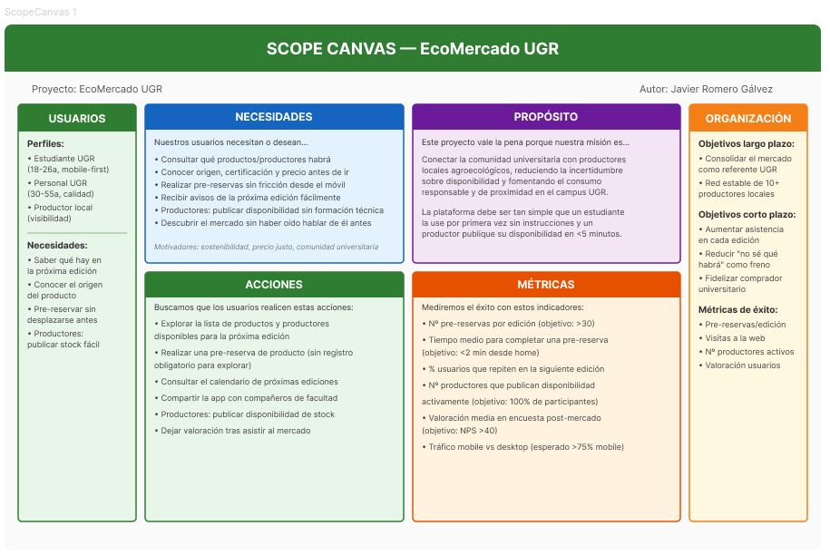
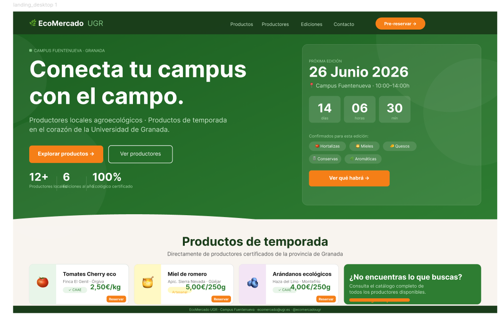
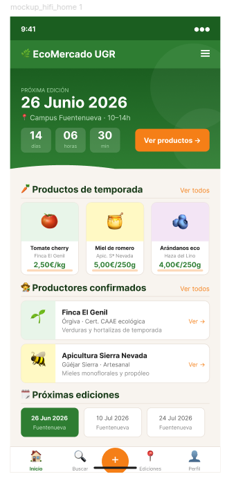
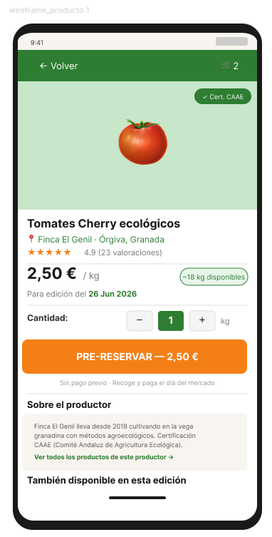
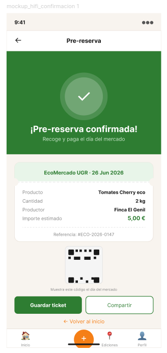

# Trabajo Final: Portfolio UX y resolución de un supuesto práctico
Diseño Interfaces de Usuario — Universidad de Granada

**Javier Romero Gálvez**  
Curso: 2025/26

---

## Índice

- [Objetivos](#objetivos)
- [Parte I: Mi experiencia UX](#parte-i-mi-experiencia-ux)
  - [Actividades de clase](#actividades-de-clase)
  - [Prácticas](#prácticas)
- [Parte II: Caso de estudio](#parte-ii-caso-de-estudio)
  - [Introducción](#introducción)
  - [1. Análisis de la web](#1-análisis-de-la-web)
  - [2. Comparativa con otra propuesta](#2-comparativa-con-otra-propuesta)
  - [3. Propuesta de valor](#3-propuesta-de-valor)
  - [4. Análisis final](#4-análisis-final)
- [Conclusión](#conclusión)

---

## Objetivos

El objetivo de este trabajo final es integrar y poner en práctica los conocimientos adquiridos a lo largo del curso de Diseño de Interfaces de Usuario desde dos perspectivas complementarias. Por un lado, un portfolio personal que recoge las aportaciones más relevantes realizadas durante las actividades de clase y las prácticas grupales, acompañado de una reflexión crítica sobre el aprendizaje en UX/UI. Por otro, un caso de estudio práctico sobre un mercado ecológico digital real, aplicando las técnicas y metodologías del diseño centrado en usuario para analizar, comparar y proponer una solución de interfaz para el **EcoMercado UGR**. El trabajo busca conectar teoría y práctica, justificando cada decisión de diseño con criterios objetivos y principios estudiados en la asignatura.

---

# PARTE I: MI EXPERIENCIA UX

## Actividades de clase

A lo largo del curso he aplicado de forma progresiva distintas técnicas del diseño centrado en usuario. A continuación destaco las actividades en las que mi contribución fue más significativa y que han tenido mayor impacto en mi formación UX.

### Actividad 1: Etnografía

El ejercicio etnográfico fue el primero en revelarme la distancia que puede existir entre el modelo mental del usuario y el modelo del sistema, concepto central en el diseño de Norman. Adoptando el rol de observador externo ("GURB"), documenté una situación real y repetida: usuarios interactuando con una máquina de validación de billetes de autobús urbano en Granada. Las personas insertaban el billete por el lado incorrecto, el sistema respondía con un pitido de error sin ninguna retroalimentación visual, y el usuario lo reintentaba varias veces antes de pedir ayuda.

Mi aportación fue identificar que el problema no residía en el usuario sino en un artefacto con **affordances ambiguas**: la ranura de inserción no diferenciaba visualmente la orientación correcta del billete, y el feedback del sistema era exclusivamente sonoro (violando **Nielsen H1: visibilidad del estado del sistema**). Propuse que una señal asimétrica en la ranura o un icono de orientación —soluciones de coste prácticamente nulo— habrían eliminado el conflicto por completo.

**Valoración:** Aprendí a no culpar al usuario y a buscar el error de diseño subyacente. Esta mentalidad es la base del pensamiento UX y ha condicionado positivamente mi forma de analizar interfaces en las actividades posteriores. La calidad de mi aportación fue alta en términos de identificación del problema y propuesta de mejora argumentada.

---

### Actividad 2 / 3: Moodboard — SHOP2 Vintage Rewind

En grupo de cuatro personas (Úrsula Barato, Pablo Antonio Caballero, Tomás Serrano y yo) desarrollamos el moodboard para **Vintage Rewind**, una tienda de moda vintage. Mi aportación específica se centró en la definición tipográfica y en la justificación de la paleta de color desde criterios de percepción y emoción, no desde la preferencia personal.

Argumenté la elección de una combinación *serif + sans-serif*: la fuente con serifa en cabecera transmite lo clásico y auténtico que la marca vintage necesita, mientras que el cuerpo en sans-serif garantiza legibilidad en pantalla. La paleta de tonos tierra y beis con acento terracota se justificó aplicando el **Modelo de Circumplex de Russell**: colores de baja activación y valencia positiva que inducen nostalgia y confort, el objetivo emocional de la marca.

En UX Writing, redacté headlines orientadas a la emoción del usuario ("Ropa con historia. Tuya desde hoy") en lugar de descripciones del producto, aplicando el principio de que el texto de interfaz debe hablar desde las motivaciones del usuario.

- **Figma moodboard + design frames:** [Ver en Figma](https://www.figma.com/design/SUTitpiTdwqGSLyLSw3pJ1/SHOP2?node-id=1-104)
- **Figma Make (diseño responsive):** [Ver prototipo](https://www.figma.com/make/htBYKFuxIi2TOntVwOOjH5/Crear-dise%C3%B1o-responsive?fullscreen=1)

**Valoración:** Aprendí que un moodboard no es una colección estética sino un contrato de coherencia visual que guía todas las decisiones de diseño posteriores.

---

### Actividad 3: Usabilidad con Eye Tracking (Gazemapping)

Utilizamos la herramienta **Gazemapping** (instalada localmente) sobre la web del **Ayuntamiento de Cádiz**, definiendo cinco POIs (Points of Interest): logos institucionales, CTA principal, próximo evento, cómo comprar entradas, y redes sociales/contacto.

Mi contribución fue diseñar los objetivos de test de manera que permitieran detectar problemas de **jerarquía visual** aplicando la **Ley de Fitts**: si los usuarios tardaban más en localizar el CTA que el logo, el área y posición del botón de acción no era óptima. Los heatmaps confirmaron que la atención se concentraba en el header y en elementos decorativos, mientras el CTA quedaba fuera de la zona caliente, violando Nielsen H1 y sugiriendo que el botón debería reposicionarse siguiendo el patrón ocular en Z documentado por Nielsen Norman Group.

**Valoración:** Esta actividad me convenció del valor de la evidencia cuantitativa. El heatmap no dice "parece poco visible"; dice exactamente dónde miró el usuario y cuánto tiempo.

---

### Actividad 4: Usabilidad con Heurio

Evaluamos webs de universidades andaluzas usando **Heurio** como extensión de Chrome. Mi aportación fue clasificar y priorizar cada problema detectado con criterio metodológico, relacionándolo con los principios de Nielsen o las directrices de Boucher en lugar de enumerarlos sin jerarquía.

Identifiqué que el menú de navegación de una de las webs cambiaba de posición entre páginas —violación directa de **Nielsen H4: consistencia y estándares**— y que los formularios de matrícula no señalizaban los campos obligatorios hasta el momento del envío —**Nielsen H9: ayudar a recuperarse de errores**—. Ambos los clasifiqué como severidad *alta* porque generan abandono predecible.

- **Proyecto Heurio del grupo:** [Ver en Heurio](https://heurio.app/project/a2tVZU10dHVjUzdCTE9pWFhKc1NUZz09)

**Valoración:** La inspección heurística es de coste bajo y alto valor cuando se aplica con rigor; su limitación es que no predice comportamiento real del usuario.

---

### Actividad 5: Accesibilidad

Esta actividad tuvo para mí el impacto formativo más alto del curso. Evaluamos la web del **Ayuntamiento de Cádiz** con **WAVE** y el simulador **Funkify**, aplicando el marco **POUR** (Perceptible, Operable, Comprensible, Robusto) de las WCAG 2.1.

WAVE reveló errores de contraste en textos secundarios y ausencia de texto alternativo en imágenes informativas (fallo en *Perceptible 1.1.1*). Con "Blurry Bianca" (baja visión), secciones enteras resultaban ilegibles. Con "Color Carl" (daltonismo), los indicadores de estado del formulario —basados únicamente en rojo/verde— dejaban de ser discriminables (*Perceptible 1.4.1*).

Mi aportación fue valorar la accesibilidad total en **62/100**, argumentando que las instituciones públicas tienen obligación legal (RD 1112/2018) de alcanzar el nivel AA de las WCAG, que este ayuntamiento no cumple.

**Valoración:** La accesibilidad no es una opción estética: es el criterio que determina si una interfaz existe o no existe para una parte significativa de la población.

---

### Actividad 6: Microinteracción y Portfolio Neo-Brutalism

Diseñé mi portfolio personal en **Figma Make** siguiendo el estilo **Neo-Brutalism**: bordes sólidos gruesos, sombras geométricas sin difuminado, tipografía Archivo Black en cabeceras y Public Sans en cuerpo, paleta de alto contraste con acento amarillo sobre fondo blanco roto.

Realicé **6 iteraciones** respondiendo al feedback de compañeros: ajusté el contraste de botones hasta superar ratio 4.5:1 (WCAG AA) y reduje la animación del splash a 1,2 segundos. La **valoración promedio final fue 9/10**.

- **Portfolio publicado:** [https://alert-slab-08744382.figma.site/](https://alert-slab-08744382.figma.site/)

**Valoración:** El diseño mejora iterando con feedback real, y el estilo visual debe subordinarse siempre a la usabilidad.

---

## Prácticas

### Prácticas grupales — Shop2 Vintage Rewind

En las prácticas de grupo aplicamos el proceso completo de diseño UX sobre una propuesta de tienda de moda vintage online.

**Investigación:** Análisis competitivo de tiendas vintage online para identificar patrones de diseño y oportunidades. Definición de perfiles de usuario y sus necesidades principales.

**Diseño:** Definí la arquitectura de información y diseñé los wireframes de las secciones principales: homepage, catálogo con filtros, ficha de producto y proceso de compra.

**Prototipado:** Mi aportación más significativa fue el prototipado responsive en Figma Make, traduciendo wireframes en un prototipo de alta fidelidad coherente con el moodboard y aplicando patrones de Material Design adaptados al contexto vintage.

**Evaluación:** Coordiné la inspección heurística del prototipo de otro grupo con Heurio, redactando el informe de evaluación relacionando cada problema con los principios de Nielsen.

El aprendizaje más valioso fue constatar que el diseño sin investigación de usuario previa resuelve los problemas del diseñador, no los del usuario.

---

# PARTE II: Caso de estudio
# Propuesta de diseño EcoMercado UGR

## Introducción

El **EcoMercado UGR** es una iniciativa del campus de Fuentenueva que conecta a productores locales agroecológicos con la comunidad universitaria. Su última edición se celebró el 28 de mayo de 2026. El mercado no tiene actualmente presencia digital propia: la información se distribuye a través de Impronta Granada, una plataforma institucional no diseñada específicamente para este tipo de evento.

Este caso de estudio analiza una propuesta digital equivalente ya existente, extrae insights y propone una interfaz para el EcoMercado UGR basada en evidencias de diseño centrado en usuario.

---

## 1. Análisis de la web

Se ha seleccionado **Nuestras Huertas** ([nuestrashuertas.com](https://www.nuestrashuertas.com/)) como referencia principal, por ser la propuesta con mayor equivalencia funcional al EcoMercado UGR: mercado local de proximidad con productores certificados y venta directa.

### User Research Plan

| Perfil | Edad | Motivación | Necesidad de diseño |
|---|---|---|---|
| Estudiante UGR | 18–26 a. | Sostenibilidad + precio justo | Info rápida, mobile-first, lista de productores |
| Personal UGR | 30–55 a. | Calidad + proximidad | Pre-reserva, calendario de ediciones |
| Productor local | 35–60 a. | Visibilidad y gestión de pedidos | Panel simple de publicación de disponibilidad |

Esta diferencia de perfil —usuario joven, universitario, nativo digital— justifica un enfoque **mobile-first** que Nuestras Huertas no prioriza.

### Usability Review

- [Ver Usability Review completo](usability-review-NuestrasHuertas.md)

**Puntuación obtenida: 68/100** (moderada)

**Puntos fuertes:**
- Jerarquía visual correcta en homepage: patrón en Z (logo → propuesta de valor → CTA → prueba social).
- Skip-to-content link presente; declaración de accesibilidad incluida.
- Trust signals efectivos: 74 reseñas Google visibles, badge EU Digital Programme.
- Contenido educativo (blog) que refuerza credibilidad y retención.

**Puntos débiles:**

| Problema | Principio violado | Severidad |
|---|---|---|
| Menú de navegación duplicado en tres zonas | Nielsen H4 — consistencia | Media |
| Precios no visibles sin varios clics | Divulgación progresiva (Krug) | Alta |
| Sin filtros por dieta/certificación | Nielsen H7 — flexibilidad | Alta |
| Botones <44px en móvil | WCAG 2.5.5 — área táctil | Media |
| Alt texts genéricos en imágenes de producto | WCAG 1.1.1 — perceptible | Media |

**Conclusión:** La web falla en transparencia de precio y adaptación móvil. Para el perfil universitario del EcoMercado UGR, ambas carencias serían críticas.

---

## 2. Comparativa con otra propuesta

Comparativa con **Xarxa Consum Solidari** ([xarxaconsum.org](https://xarxaconsum.org/es/mercados-de-campesinos/)), red de mercados de productores en Barcelona con modelo cooperativo, más cercano al espíritu del EcoMercado UGR.

| Categoría | | Nuestras Huertas | Xarxa Consum |
|---|---|---|---|
| **Modelo de negocio** | Venta directa online | Sí | No |
| | Modelo cooperativo/comunitario | No | Sí |
| | Transparencia de productores | Parcial | Alta |
| **Tecnología** | Diseño responsive | Sí | Sí |
| | Mapa de ubicaciones | No | Sí |
| | Integración mensajería | No | Sí |
| **Funcionalidad** | Buscador de productos | Sí | No |
| | Pre-reserva | Sí (cestas) | Parcial |
| | Calendario de mercados | Sí | Sí |
| **Usabilidad** | Navegación visible siempre | Sí | Sí |
| | FAQ / contacto accesible | No | Sí |
| | Filtros por categoría | No | Sí |
| **Fortalezas** | | E-commerce maduro, trust signals | Comunidad activa, transparencia de origen |
| **Debilidades** | | Sin filtros, precio oculto, móvil deficiente | Sin venta online, galería densa en móvil |

**Conclusión:** El EcoMercado UGR debe combinar la madurez de e-commerce de Nuestras Huertas con el espíritu de comunidad y transparencia de Xarxa Consum, adaptados a un perfil universitario mobile-first.

---

## 3. Propuesta de valor

### Scope Canvas

**Propuesta central:**
> *EcoMercado UGR App* — "Conecta tu campus con el campo"  
> Una Progressive Web App mobile-first que permite a la comunidad universitaria consultar qué productores y productos estarán disponibles en la próxima edición del mercado, realizar pre-reservas y conocer el origen de cada alimento.

### Landing Page

Diseño de la landing page en versión escritorio (1440px), con jerarquía visual clara: propuesta de valor → countdown a la próxima edición → productos de temporada → CTA.

### Mockup Hi-Fi — App Mobile

Pantallas de alta fidelidad de la Progressive Web App, diseñadas mobile-first (390px):

#### Pantalla Home — Próxima edición y productos de temporada

#### Pantalla Wireframe — Detalle de producto y pre-reserva

#### Pantalla Confirmación — Ticket de pre-reserva

> Los mockups han sido diseñados para importarse en **Figma** como vectores editables y conectarse mediante el modo Prototype, simulando el flujo completo: Home → Detalle producto → Pre-reserva → Confirmación con ticket QR.

### Decisiones de diseño justificadas

**Mobile-first:** El perfil universitario genera tráfico predominantemente desde móvil. Un diseño que no prioriza el móvil excluye al usuario principal.

**Pre-reserva sin registro obligatorio para explorar:** Aplicando la regla de Krug de no obligar al usuario a registrarse para ver contenido, la exploración es libre; el registro solo se activa para confirmar la pre-reserva.

**Transparencia del productor en primer nivel:** Nombre, municipio y certificación visibles en la card sin necesidad de clic adicional. Los usuarios del mercado ecológico valoran el origen como criterio de decisión.

**Área táctil ≥ 44px en todos los CTAs:** Cumplimiento de WCAG 2.5.5 y Apple HIG, garantizando usabilidad para usuarios con dificultades motóricas finas.

**Calendario de ediciones prominente:** La periodicidad mensual es una característica distintiva. Mostrarla claramente convierte la temporalidad en anticipación positiva.

**Paleta de color:**

| Uso | Color | Justificación |
|---|---|---|
| Fondo | `#F8F4EF` | Blanco cálido; evoca papel natural, coherente con lo ecológico |
| Primario | `#2E7D32` | Verde oscuro; asociación cultural con naturaleza y sostenibilidad |
| Acento | `#F57F17` | Ámbar; evoca tierra y cosecha, alta visibilidad para CTAs |
| Texto | `#1A1A1A` | Ratio contraste >7:1 sobre fondo (WCAG AAA) |

---

## 4. Análisis final

### Lo que he aplicado de las prácticas

En el análisis de *Nuestras Huertas* he aplicado directamente la **inspección heurística** practicada en la Actividad 4 (Heurio) y el **marco POUR de accesibilidad** de la Actividad 5. En la propuesta del EcoMercado UGR he aplicado el pensamiento de **moodboard** para definir paleta y tipografía, y el conocimiento de **eye-tracking** para diseñar la jerarquía visual de la home siguiendo el patrón en Z. Las **prácticas de grupo** (Shop2) me han dado el marco estructurado: definir usuarios, analizar competencia, extraer insights y traducirlos en decisiones de interfaz argumentadas.

### Lo que me ha faltado y habría mejorado el resultado

**Investigación de usuario primaria:** La propuesta descansa en perfiles inferidos, no en datos propios. Habría sido imprescindible realizar al menos 6–8 entrevistas con estudiantes y personal UGR para validar si la pre-reserva es una necesidad real o una funcionalidad que nadie usaría.

**Test con usuarios sobre el prototipo:** Para validar el diseño sería necesario construir un prototipo clickable en Figma y realizar un test de usabilidad con 5 usuarios (metodología Nielsen: detecta el 85% de los problemas).

**Mapa de empatía y Journey Map:** Habrían permitido mapear las emociones del estudiante desde que descubre el EcoMercado hasta que asiste, identificando puntos de fricción que el análisis de interfaz no captura.

**A/B Testing:** La elección de mostrar el calendario en posición destacada es una decisión que solo puede validarse con datos reales de comportamiento.

**Eye-tracking sobre los sitios analizados:** Aplicar Gazemapping sobre *Nuestras Huertas* habría validado con evidencia cuantitativa los problemas de jerarquía visual identificados mediante inspección heurística.

---

## Conclusión

Este trabajo me ha permitido cerrar el ciclo iniciado en la Actividad 1: del "detectar un problema de diseño observando a alguien en la calle" al "proponer una interfaz completa para un caso real con criterios argumentados". He pasado de entender el diseño de interfaces como una actividad estética a comprenderlo como un proceso de toma de decisiones basadas en evidencia, donde cada elección puede justificarse o refutarse con principios y datos.

He adquirido competencia práctica en las herramientas fundamentales del campo (Figma, Heurio, WAVE, Gazemapping, Funkify) y he desarrollado la capacidad de comunicar problemas de diseño con criterios cuantificables. Mi nivel de experiencia UX al término del curso lo sitúo en **junior fundamentado**: conozco y aplico las metodologías, identifico y argumento problemas reales, y entiendo la diferencia entre una decisión de diseño defendible y una basada únicamente en preferencia personal.

---

## Referencias

- Nielsen, J. (1994). *10 Usability Heuristics for User Interface Design*. Nielsen Norman Group.
- Norman, D. (2013). *The Design of Everyday Things*. Basic Books.
- Krug, S. (2014). *Don't Make Me Think, Revisited*. New Riders.
- W3C (2018). *Web Content Accessibility Guidelines (WCAG) 2.1*. https://www.w3.org/TR/WCAG21/
- Lidwell, W., Holden, K., Butler, J. (2010). *Universal Principles of Design*. Rockport.
- Fitts, P.M. (1954). The information capacity of the human motor system. *Journal of Experimental Psychology*, 47(6), 381–391.
- Real Decreto 1112/2018, accesibilidad sitios web sector público.
- Nuestras Huertas: https://www.nuestrashuertas.com/
- Xarxa Consum Solidari: https://xarxaconsum.org/es/mercados-de-campesinos/
- EcoMercado UGR: https://improntagranada.es/evento/jornada-inaugural-del-ecomercado-ugr/
- Portfolio personal (Act. 6): https://alert-slab-08744382.figma.site/
- Proyecto SHOP2 Figma: https://www.figma.com/design/SUTitpiTdwqGSLyLSw3pJ1/SHOP2
- Heurio grupo: https://heurio.app/project/a2tVZU10dHVjUzdCTE9pWFhKc1NUZz09
